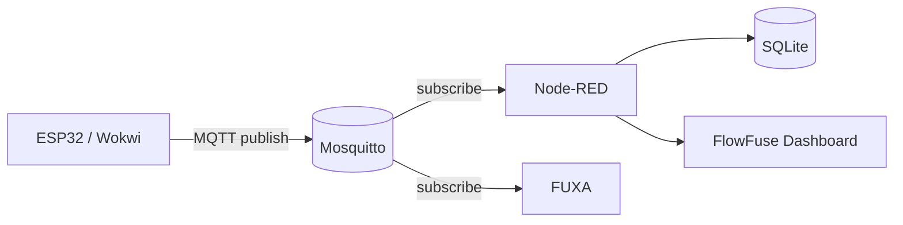
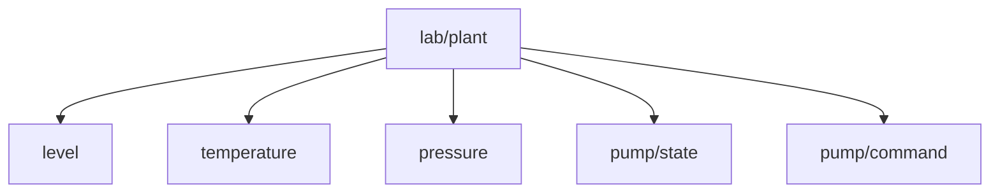

# 01 — MQTT e a planta didática

## Objetivos

Ao final desta prática, o aluno deverá ser capaz de:

- explicar o papel do broker MQTT;
- publicar e assinar tópicos com `mosquitto_pub` e `mosquitto_sub`;
- reconhecer a convenção de tópicos da planta;
- enviar uma variável do processo para o Node-RED;
- relacionar MQTT com o modelo **publisher/subscriber**.

## Arquitetura



O MQTT é usado aqui como transporte de dados IoT. O broker não precisa conhecer o significado da variável; ele apenas encaminha mensagens pelos tópicos.

## 1. Inicie o laboratório

Na raiz de `scada-lab/`:

```powershell
./scripts/up.ps1
```

Verifique:

```powershell
docker compose ps
```

O broker está disponível no host em `localhost:1883`. Dentro da rede Docker, os clientes devem usar `mosquitto:1883`.

:::tip[Regra importante]
Entre containers, **não use `localhost` para acessar outro serviço**. Use o nome do serviço Docker, por exemplo `mosquitto`.
:::

## 2. Observe o broker

Em um terminal:

```powershell
docker compose exec mosquitto mosquitto_sub -h localhost -t "lab/plant/#" -v
```

Em outro:

```powershell
docker compose exec mosquitto mosquitto_pub -h localhost -t lab/plant/level -m 65.5
```

Resultado esperado:

```text
lab/plant/level 65.5
```

## 3. Convenção de tópicos

| Tópico                   | Tipo        |      Exemplo |
| ------------------------ | ----------- | -----------: |
| `lab/plant/level`        | nível       |       `65.5` |
| `lab/plant/temperature`  | temperatura |       `27.2` |
| `lab/plant/pressure`     | pressão     |        `2.1` |
| `lab/plant/pump/state`   | estado      | `ON` / `OFF` |
| `lab/plant/pump/command` | comando     | `ON` / `OFF` |



## 4. Teste comandos da bomba

Publique um comando:

```powershell
docker compose exec mosquitto mosquitto_pub -h localhost -t lab/plant/pump/command -m ON
```

Depois:

```powershell
docker compose exec mosquitto mosquitto_pub -h localhost -t lab/plant/pump/command -m OFF
```

:::note
O simulador desta versão gera o estado do processo internamente. O tópico de comando é usado principalmente para a prática de integração; a implementação de controle fechado pode ser adicionada como extensão.
:::

## 5. Evidências

Entregue:

1. captura do `mosquitto_sub` recebendo pelo menos três variáveis;
2. explicação de publisher, subscriber, broker, topic e payload;
3. uma publicação feita manualmente;
4. um pequeno diagrama da comunicação.

## 6. Desafio

Crie um novo tópico:

```text
lab/plant/alarm/temperature_high
```

Publique `true` quando a temperatura ultrapassar um limite escolhido por você e explique por que o tópico é diferente de `lab/plant/temperature`.

## Diagnóstico

| Sintoma                       | Verificação                        |
| ----------------------------- | ---------------------------------- |
| Nenhuma mensagem              | confirme `docker compose ps`       |
| Broker recusando conexão      | confirme a porta `1883`            |
| Container não encontra broker | use `mosquitto`, não `localhost`   |
| Tópico vazio                  | confira exatamente `lab/plant/...` |
