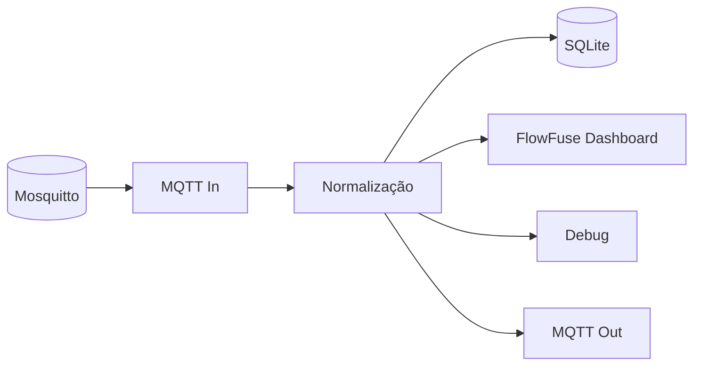
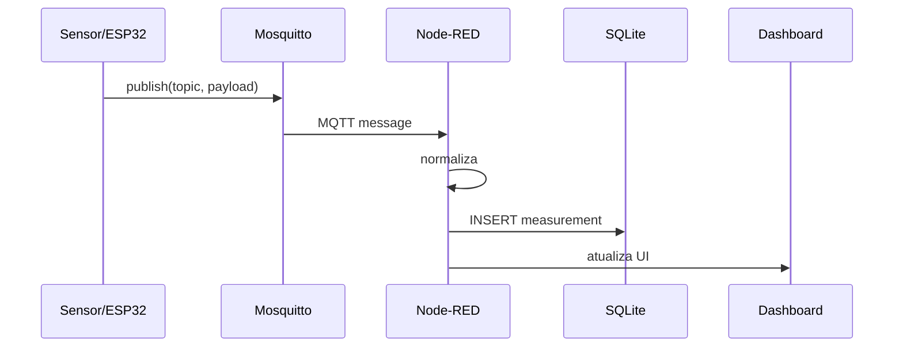

# 02 — Node-RED: integração e automação

## Papel do Node-RED

Neste laboratório, o Node-RED não substitui o SCADA. Ele funciona como camada de **integração, transformação, automação e persistência**.



## 1. Acesse o editor

Abra:

```text
http://localhost:1880
```

O projeto já possui um fluxo inicial. Ele recebe `lab/plant/#`, normaliza os dados e prepara o registro para SQLite.

## 2. Conheça o fluxo inicial

O fluxo possui quatro etapas conceituais:

1. **entrada** — recebe mensagens MQTT;
2. **transformação** — identifica variável e valor;
3. **persistência** — grava em SQLite;
4. **visualização/diagnóstico** — Debug e Dashboard.



## 3. Teste pelo MQTT

```powershell
docker compose exec mosquitto mosquitto_pub -h localhost -t lab/plant/temperature -m 29.4
```

No Node-RED, observe o Debug. O fluxo deve receber a mensagem.

## 4. Faça uma transformação

Adicione um `function` depois do MQTT In e transforme o payload em número:

```javascript
const value = Number(msg.payload);

if (!Number.isFinite(value)) {
  node.warn(`Valor inválido: ${msg.payload}`);
  return null;
}

msg.payload = value;
return msg;
```

:::warning[Atenção ao tipo]
MQTT normalmente transporta o payload como bytes/string. A conversão explícita evita comparar `"30"` como texto em vez de `30` como número.
:::

## 5. Crie uma regra de alarme

Exemplo para temperatura:

```javascript
const value = Number(msg.payload);
msg.alarm = value > 30;
msg.topic = "lab/plant/alarm/temperature_high";
msg.payload = msg.alarm;
return msg;
```

Conecte a saída a um `mqtt out` apontando para `mosquitto`.

## 6. Dashboard

O projeto instala `@flowfuse/node-red-dashboard`. O Dashboard 2 organiza a interface em **base → page → group → widget** e pode ser acessado em `/dashboard`.

Abra:

```text
http://localhost:1880/dashboard
```

Se o fluxo ainda não possuir widgets, adicione uma página e um grupo e experimente `ui-text`, `ui-gauge`, `ui-chart` ou `ui-button`.

## Evidências

- fluxo MQTT → função → saída;
- transformação numérica;
- uma regra de alarme;
- captura do Dashboard.

## Desafio

Crie três níveis de alarme:

```text
NORMAL       < 30 °C
ATENÇÃO      30–35 °C
CRÍTICO      > 35 °C
```

Não altere o tópico original da temperatura; publique o estado do alarme em um tópico separado.
