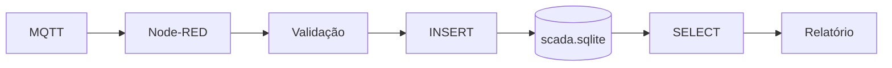
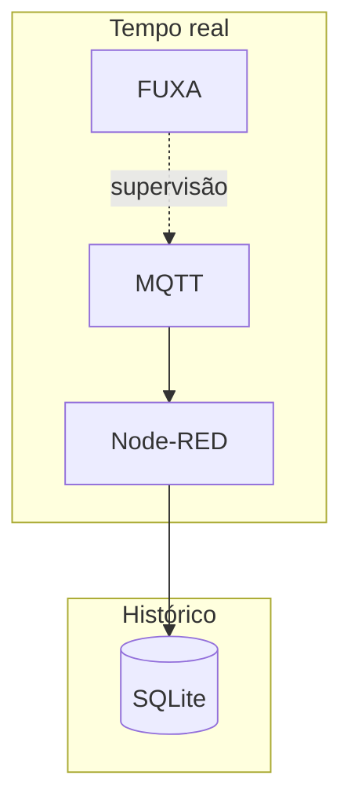

# 03 — SQLite e histórico

## Objetivos

- compreender o papel de um banco local em um SCADA didático;
- consultar medições armazenadas pelo Node-RED;
- relacionar timestamp, tópico e valor;
- construir uma consulta para análise histórica.



## 1. Localização

O banco usado pelo fluxo é:

```text
node-red/data/scada.sqlite
```

Ele fica no volume de dados do Node-RED, portanto deve ser tratado como dado do laboratório e não como parte do código-fonte.

## 2. Estrutura conceitual

A tabela inicial `measurements` representa uma série simples:

| Campo | Significado |
|---|---|
| `timestamp` | instante da medição |
| `topic` | origem MQTT |
| `value` | valor numérico |

Consulte o esquema diretamente:

```powershell
docker compose exec node-red sh -lc 'sqlite3 /data/scada.sqlite ".schema measurements"'
```

:::tip
Se a imagem não possuir o cliente `sqlite3`, use um cliente SQLite no host ou o próprio nó SQLite do Node-RED para executar consultas.
:::

## 3. Gere dados

```powershell
docker compose exec mosquitto mosquitto_pub -h localhost -t lab/plant/level -m 70
```

Repita com temperatura e pressão.

## 4. Consulta básica

```sql
SELECT timestamp, topic, value
FROM measurements
ORDER BY timestamp DESC
LIMIT 20;
```

Consulta somente temperatura:

```sql
SELECT timestamp, value
FROM measurements
WHERE topic = 'lab/plant/temperature'
ORDER BY timestamp DESC;
```

## 5. Arquitetura de dados



## 6. Perguntas de análise

1. Por que não é necessário armazenar a mensagem MQTT inteira?
2. Qual a diferença entre `topic` e `value`?
3. O timestamp deve ser gerado no ESP32, no broker ou no consumidor? Compare as alternativas.
4. Como detectar valores ausentes?

## Evidências

Entregue uma consulta que mostre as últimas 10 temperaturas e uma captura do resultado.

## Desafio

Calcule média, mínimo e máximo da temperatura:

```sql
SELECT
    AVG(value) AS media,
    MIN(value) AS minimo,
    MAX(value) AS maximo
FROM measurements
WHERE topic = 'lab/plant/temperature';
```
