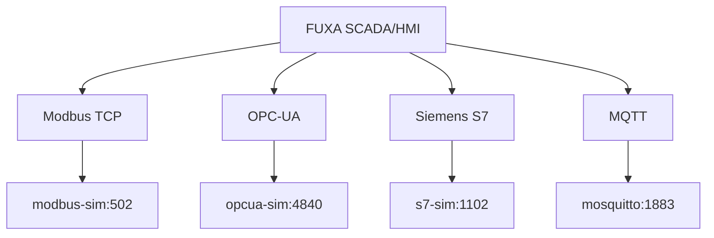
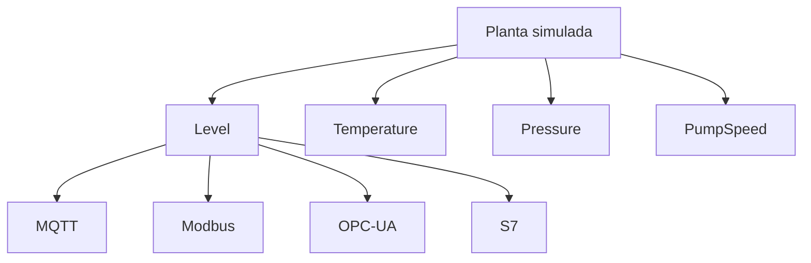

# 04 — FUXA: configuração SCADA/HMI

## O papel do FUXA

O FUXA é a camada **SCADA/HMI** deste laboratório. A documentação oficial lista conectores para Modbus RTU/TCP, Siemens S7, OPC-UA e MQTT, além de outros protocolos.

A ideia didática é manter a mesma planta e acessá-la por quatro protocolos.



:::warning[Endereços Docker]
Dentro do container FUXA, use os nomes dos serviços (`modbus-sim`, `opcua-sim`, `s7-sim`, `mosquitto`). `localhost` apontaria para o próprio container FUXA.
:::

## 1. Abra o FUXA

```text
http://localhost:1881
```

O FUXA separa a edição do projeto da visualização da aplicação. A configuração de dispositivos e tags é feita na área **Connections** do editor.

## 2. Procedimento geral para qualquer protocolo

A sequência didática é:


:::note Interface do FUXA
Os nomes exatos de botões e campos podem mudar entre versões. O procedimento abaixo descreve os dados que devem ser informados; se a interface apresentar um assistente equivalente, use os mesmos valores.
:::

---

## 3. Dispositivo 1 — MQTT

### 3.1 Criar a conexão

Em **Connections**, adicione um dispositivo/conexão MQTT.

Use:

| Campo          | Valor                       |
| -------------- | --------------------------- |
| Host           | `mosquitto`                 |
| Port           | `1883`                      |
| TLS            | desabilitado no laboratório |
| Authentication | anônima no laboratório      |

A documentação do FUXA mostra a criação de uma conexão MQTT e uma assinatura de tópico na área de Devices/Tags.

### 3.2 Criar as tags

Crie assinaturas para:

```text
lab/plant/level
lab/plant/temperature
lab/plant/pressure
lab/plant/pump/state
```

Use nomes de tags simples:

```text
MQTT_Level
MQTT_Temperature
MQTT_Pressure
MQTT_PumpState
```

### 3.3 Teste

Publique:

```powershell
docker compose exec mosquitto mosquitto_pub -h localhost -t lab/plant/level -m 73.2
```

Confirme no FUXA que `MQTT_Level` mudou para `73.2`.

---

## 4. Dispositivo 2 — Modbus TCP

### 4.1 Criar o dispositivo

Em **Connections**, adicione um dispositivo Modbus TCP.

Use:

| Campo         | Valor        |
| ------------- | ------------ |
| Host          | `modbus-sim` |
| Port          | `502`        |
| Unit/Slave ID | `1`          |
| Tipo          | TCP          |

A documentação do FUXA indica que conexões Modbus são adicionadas pela área de conexões e que o driver pode precisar ser habilitado/instalado conforme a versão.

### 4.2 Holding Registers

O simulador publica:

| Variável    | Registro lógico | Valor armazenado |
| ----------- | --------------: | ---------------: |
| Level       |     HR0 / 40001 |       nível × 10 |
| Temperature |     HR1 / 40002 | temperatura × 10 |
| Pressure    |     HR2 / 40003 |     pressão × 10 |
| PumpSpeed   |     HR3 / 40004 |  velocidade × 10 |

:::warning[0-based versus 40001]
Algumas interfaces exibem `40001`, enquanto outras pedem o offset PDU `0`. Se o FUXA pedir o endereço de registro, use o formato exigido pela versão instalada. Para este simulador, o primeiro holding register é o offset **0**.
:::

### 4.3 Escala

Como o simulador envia `level × 10`, o valor físico é:

```text
Level = register / 10
```

Faça o mesmo para temperatura, pressão e velocidade.

### 4.4 Coils

| Variável    |      Coil |
| ----------- | --------: |
| PumpRunning | 0 / 00001 |
| PumpCommand | 1 / 00002 |

Teste a leitura e, se o driver/controle da sua versão permitir escrita, teste o comando.

---

## 5. Dispositivo 3 — OPC-UA

### 5.1 Criar o dispositivo

Adicione uma conexão OPC-UA.

Use o endpoint:

```text
opc.tcp://opcua-sim:4840/freeopcua/server/
```

### 5.2 Navegar pela árvore

A estrutura criada pelo simulador é:

```text
Objects
└── Plant
    ├── Tank
    │   ├── Level
    │   ├── Temperature
    │   └── Pressure
    └── Pump
        ├── Running
        └── Speed
```

Depois que o dispositivo estiver conectado, o FUXA permite adicionar tags OPC-UA a partir do dispositivo conectado.

:::tip[Não fixe o NodeId]
O simulador usa IDs internos do servidor OPC-UA. Para a prática, navegue pela árvore no FUXA e selecione os nós pelo caminho lógico. Isso evita depender de um NodeId numérico específico.
:::

### 5.3 Tags esperadas

Crie:

```text
OPCUA_Level
OPCUA_Temperature
OPCUA_Pressure
OPCUA_PumpRunning
OPCUA_PumpSpeed
```

### 5.4 Teste

O simulador atualiza as variáveis aproximadamente uma vez por segundo. Observe a alteração de `Level`, `Temperature` e `Speed`.

---

## 6. Dispositivo 4 — Siemens S7

### 6.1 Criar o dispositivo

Adicione uma conexão Siemens S7.

Use:

| Campo   | Valor              |
| ------- | ------------------ |
| Host/IP | `s7-sim`           |
| Port    | `1102`             |
| Rack    | `0`, se solicitado |
| Slot    | `1`, se solicitado |

:::warning[Porta didática]
O S7 tradicional normalmente usa TCP/102. Este laboratório usa `1102` deliberadamente para evitar depender de uma porta privilegiada no host. O simulador também escuta diretamente em `1102`.
:::

### 6.2 DB1

O simulador disponibiliza:

| Endereço      | Tipo | Variável    |
| ------------- | ---- | ----------- |
| `DB1.DBD0`    | REAL | Level       |
| `DB1.DBD4`    | REAL | Temperature |
| `DB1.DBD8`    | REAL | Pressure    |
| `DB1.DBD12`   | REAL | PumpSpeed   |
| `DB1.DBX16.0` | BOOL | PumpRunning |
| `DB1.DBX16.1` | BOOL | PumpCommand |

Crie as tags correspondentes no FUXA.

:::note[Compatibilidade]
O servidor Python é um simulador didático, não um PLC Siemens real. Se uma versão específica do driver S7 do FUXA exigir parâmetros adicionais, mantenha a mesma estrutura DB1 e adapte apenas os campos de conexão solicitados pelo driver.
:::

---

## 7. Organize as tags

Uma convenção útil:

```text
MQTT_Level
MODBUS_Level
OPCUA_Level
S7_Level
```

Repita para temperatura, pressão e velocidade.



Isso permite comparar protocolos sem misturar a origem de cada tag.

## 8. Monte a primeira View

Crie uma tela simples contendo:

- indicador numérico de nível;
- temperatura;
- pressão;
- velocidade da bomba;
- estado da bomba;
- um gráfico histórico, se desejado;
- indicação da origem do dado.

Exemplo de layout conceitual:

```text
+------------------------------------------------+
| SCADA LAB — TANQUE                             |
+----------------------+-------------------------+
| LEVEL                | TEMPERATURE             |
|  72.3 %              | 27.8 °C                 |
+----------------------+-------------------------+
| PRESSURE             | PUMP                    |
|  2.1 bar             | 72 %   RUNNING         |
+----------------------+-------------------------+
| MQTT | MODBUS | OPC-UA | S7                    |
+------------------------------------------------+
```

## 9. Checklist de conexão

| Protocolo  | Endpoint dentro do Docker | Variável de teste  |
| ---------- | ------------------------- | ------------------ |
| MQTT       | `mosquitto:1883`          | `lab/plant/level`  |
| Modbus TCP | `modbus-sim:502`          | HR0                |
| OPC-UA     | `opcua-sim:4840`          | `Plant/Tank/Level` |
| S7         | `s7-sim:1102`             | `DB1.DBD0`         |

## 10. Integração com Node-RED

O FUXA atual também possui integração com Node-RED. A documentação oficial descreve nós para obter/alterar tags, monitorar mudanças e acessar histórico/DAQ.

No entanto, neste laboratório mantemos a separação pedagógica:

- **FUXA** → supervisão e comunicação industrial;
- **Node-RED** → integração, automação e persistência;
- **Mosquitto** → transporte MQTT;
- **SQLite** → histórico simples.

## Evidências

Entregue:

1. quatro conexões criadas;
2. pelo menos uma tag funcionando em cada protocolo;
3. uma View FUXA mostrando a planta;
4. tabela com endpoint e variável testada.

## Troubleshooting

### FUXA não conecta ao serviço

Teste a resolução de nome dentro da rede:

```powershell
docker compose exec fuxa getent hosts modbus-sim
```

Se o comando não existir na imagem, use os logs:

```powershell
docker compose logs fuxa
```

### Modbus mostra valor dez vezes maior

Aplique a escala `/10`.

### OPC-UA não mostra tags

Primeiro confirme que o dispositivo está conectado; a própria documentação do FUXA indica que as tags OPC-UA são adicionadas depois que o dispositivo está conectado.

### S7 não conecta

Confirme que o alvo é `s7-sim:1102`, não `localhost:102`.
