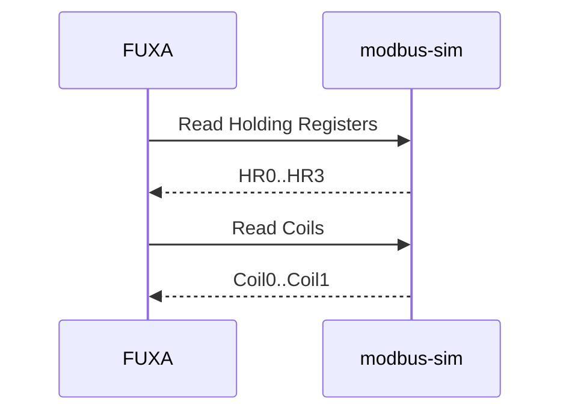

# 05 — Prática Modbus TCP

## Objetivos

- diferenciar coil e holding register;
- compreender endereço lógico versus offset PDU;
- aplicar escala de dados;
- configurar o mesmo processo no FUXA usando Modbus TCP.



## Endpoint

Dentro do Docker:

```text
modbus-sim:502
Unit ID: 1
```

No host, a porta é `502` conforme `.env`.

## Mapa

| Offset | Notação comum | Tipo             |   Escala |
| -----: | ------------: | ---------------- | -------: |
|      0 |         40001 | Holding Register |    `/10` |
|      1 |         40002 | Holding Register |    `/10` |
|      2 |         40003 | Holding Register |    `/10` |
|      3 |         40004 | Holding Register |    `/10` |
|      0 |         00001 | Coil             | booleano |
|      1 |         00002 | Coil             | booleano |

## Exercício

1. No FUXA, crie o dispositivo Modbus TCP.
2. Configure `modbus-sim:502`.
3. Use Unit ID `1`.
4. Adicione os quatro holding registers.
5. Aplique escala `/10`.
6. Adicione as duas coils.
7. Mostre os valores na View.

## Validação externa

Se possuir um cliente Modbus no host, conecte em:

```text
localhost:502
```

Compare os valores crus com os valores físicos exibidos no FUXA.

## Perguntas

1. Por que `65.0 °C` aparece como `650` no registro?
2. Qual a diferença entre coil e holding register?
3. O que pode acontecer se o cliente usar offset 1 quando o servidor espera offset 0?

## Entrega

Tabela contendo:

```text
variável | endereço | valor bruto | valor escalado
```

## Desafio

Adicione uma segunda tela mostrando simultaneamente os valores crus e escalados.
