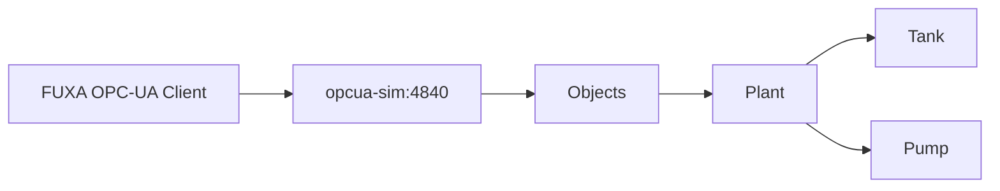

# 06 — Prática OPC-UA

## Objetivos

- entender endpoint e namespace OPC-UA;
- navegar por uma árvore de objetos;
- criar tags no FUXA a partir dos nós OPC-UA;
- comparar OPC-UA com Modbus.



## Endpoint

```text
opc.tcp://opcua-sim:4840/freeopcua/server/
```

## Árvore

```text
Objects
└── Plant
    ├── Tank
    │   ├── Level
    │   ├── Temperature
    │   └── Pressure
    └── Pump
        ├── Running
        └── Speed
```

## Roteiro

1. Abra FUXA → **Connections**.
2. Adicione um dispositivo OPC-UA.
3. Informe o endpoint acima.
4. Conecte o dispositivo.
5. Navegue pela árvore de nós.
6. Adicione `Level`, `Temperature`, `Pressure`, `Running` e `Speed` como tags.
7. Crie uma View com os cinco valores.

A documentação do FUXA confirma que o dispositivo OPC-UA deve estar conectado antes da criação das tags e mostra o fluxo de adicionar o dispositivo e depois os tags.

:::tip
Prefira selecionar os nós pelo navegador do FUXA em vez de copiar NodeIds numéricos. O simulador cria seus identificadores internamente.
:::

## Comparação com Modbus

| Característica | Modbus TCP                 | OPC-UA          |
| -------------- | -------------------------- | --------------- |
| Modelo         | registradores/coils        | objetos/nós     |
| Navegação      | mapa conhecido             | namespace       |
| Escala         | necessária neste simulador | valores físicos |
| Endpoint       | host + porta               | URI OPC-UA      |

## Perguntas

1. O que representa `Objects`?
2. Por que o caminho `Plant/Tank/Level` é útil didaticamente?
3. Que vantagem um namespace estruturado oferece em relação a uma tabela plana de registradores?

## Entrega

Captura da árvore OPC-UA no FUXA e tabela com os cinco tags.

## Desafio

Crie uma View que organize os tags em dois grupos: `Tank` e `Pump`.
