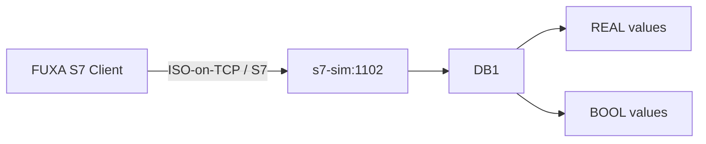
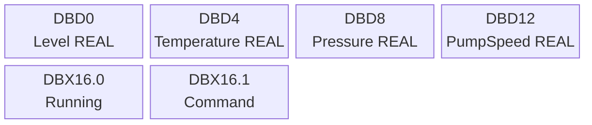

# 07 — Prática Siemens S7

## Objetivos

- reconhecer a organização de dados de um PLC S7;
- acessar DB1 por Ethernet;
- interpretar REAL e BOOL;
- configurar as tags S7 no FUXA.



## Endpoint didático

```text
s7-sim:1102
```

:::warning[Sobre a porta 1102]
A porta padrão de muitos equipamentos S7 é TCP/102. Neste laboratório, o simulador foi configurado em `1102` para evitar a dependência de uma porta privilegiada no host.
:::

## DB1

| Endereço      | Tipo | Variável    |
| ------------- | ---- | ----------- |
| `DB1.DBD0`    | REAL | Level       |
| `DB1.DBD4`    | REAL | Temperature |
| `DB1.DBD8`    | REAL | Pressure    |
| `DB1.DBD12`   | REAL | PumpSpeed   |
| `DB1.DBX16.0` | BOOL | PumpRunning |
| `DB1.DBX16.1` | BOOL | PumpCommand |



## Configuração no FUXA

1. Abra **Connections**.
2. Adicione um dispositivo Siemens S7.
3. Informe host `s7-sim`.
4. Informe porta `1102`, se o driver apresentar campo de porta.
5. Se forem solicitados rack/slot, use `0/1` como configuração didática inicial.
6. Conecte.
7. Crie tags para os endereços de DB1.
8. Para `DBD0..DBD12`, selecione `REAL`/`Float` conforme a nomenclatura da versão do driver.
9. Para `DBX16.0` e `DBX16.1`, selecione `BOOL`.

:::note
O simulador é um servidor S7 para testes, não um PLC Siemens real. A compatibilidade do driver S7 com servidores simulados pode variar por versão. Se a conexão falhar, primeiro confirme host, porta e logs do container.
:::

## Validação

Observe:

- `Level` variando;
- `Temperature` variando;
- `Pressure` variando;
- `PumpSpeed` variando quando `running=true`;
- `PumpRunning` como booleano.

## Comparação

Represente a mesma variável como:

```text
MQTT_Level
MODBUS_Level
OPCUA_Level
S7_Level
```

A View deve permitir comparar as quatro fontes.

## Entrega

1. configuração da conexão;
2. tabela de DB1;
3. captura da View;
4. comentário sobre a diferença entre endereço absoluto e tag semântica.

## Desafio

Crie um botão de comando para `PumpCommand` e registre no relatório se o servidor simulado aceita ou não a escrita através do driver usado.
