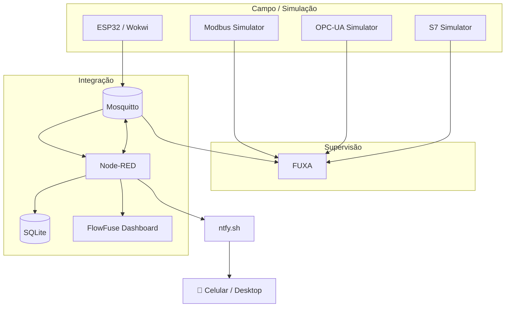
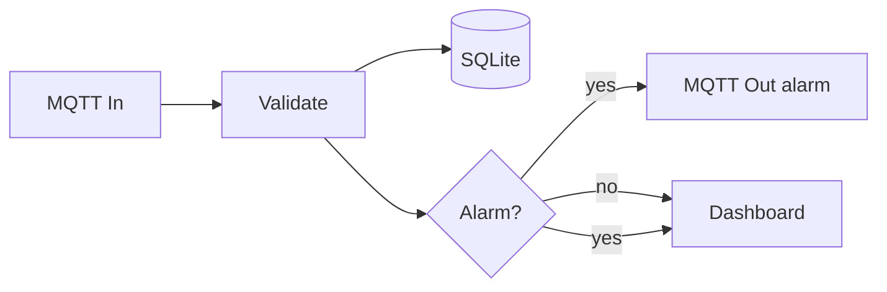
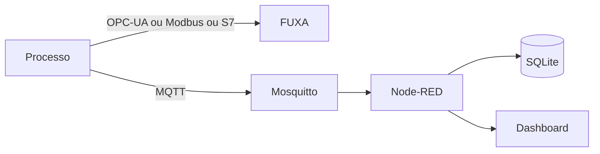
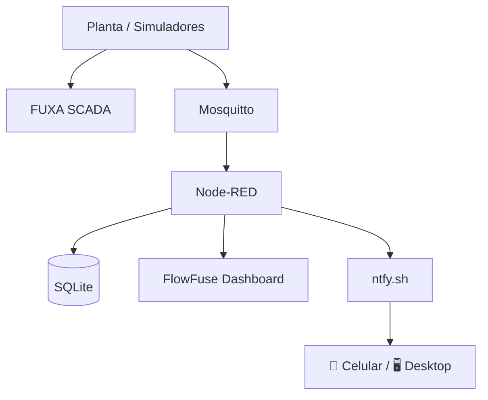

# 08 — Integração dos quatro protocolos

Esta é a prática de síntese. O objetivo não é apenas fazer quatro conexões funcionarem, mas entender **onde cada componente deve ficar na arquitetura**.

## Arquitetura final



## 1. Roteiro completo das práticas

| Prática | Tema       | Produto                   |
| ------: | ---------- | ------------------------- |
|      01 | MQTT       | publicação/assinatura     |
|      02 | Node-RED   | fluxo de integração       |
|      03 | SQLite     | histórico consultável     |
|      04 | FUXA       | SCADA com quatro drivers  |
|      05 | Modbus TCP | mapa de registradores     |
|      06 | OPC-UA     | namespace e tags          |
|      07 | S7         | DB1 e tipos               |
|      08 | Integração | supervisão multiprotocolo |
|      09 | Alarmes    | ntfy + notificações push  |

## 2. Matriz da mesma variável

O ponto central da prática é comparar a representação da mesma grandeza:

| Grandeza    | MQTT                    | Modbus   | OPC-UA                   | S7            |
| ----------- | ----------------------- | -------- | ------------------------ | ------------- |
| Level       | `lab/plant/level`       | HR0 × 10 | `Plant/Tank/Level`       | `DB1.DBD0`    |
| Temperature | `lab/plant/temperature` | HR1 × 10 | `Plant/Tank/Temperature` | `DB1.DBD4`    |
| Pressure    | `lab/plant/pressure`    | HR2 × 10 | `Plant/Tank/Pressure`    | `DB1.DBD8`    |
| PumpSpeed   | —                       | HR3 × 10 | `Plant/Pump/Speed`       | `DB1.DBD12`   |
| PumpRunning | `lab/plant/pump/state`  | Coil0    | `Plant/Pump/Running`     | `DB1.DBX16.0` |

## 3. Parte A — supervisão

No FUXA, crie uma View chamada:

```text
SCADA Lab — Planta
```

Organize:

```text
┌─────────────────────────────────────────────┐
│ SCADA LAB — PLANTA                          │
├──────────────────┬──────────────────────────┤
│ LEVEL            │ TEMPERATURE              │
│ 72.4 %           │ 27.8 °C                 │
├──────────────────┼──────────────────────────┤
│ PRESSURE         │ PUMP                     │
│ 2.1 bar          │ 72 % / RUNNING           │
├─────────────────────────────────────────────┤
│ ORIGEM: MQTT | MODBUS | OPC-UA | S7        │
└─────────────────────────────────────────────┘
```

## 4. Parte B — integração Node-RED

O Node-RED deve:

1. receber MQTT;
2. validar o valor;
3. gravar no SQLite;
4. publicar alarmes;
5. alimentar o Dashboard.



## 5. Parte C — Dashboard

Abra:

```text
http://localhost:1880/dashboard
```

Crie pelo menos:

- indicador de nível;
- indicador de temperatura;
- indicador de pressão;
- estado da bomba;
- gráfico de temperatura;
- botão ou controle para um comando, quando aplicável.

O FlowFuse Dashboard utiliza a hierarquia base → page → group → widget.

## 6. Parte D — teste cruzado

Para `Level`, registre:

```text
MQTT       = ______
Modbus     = ______
OPC-UA     = ______
S7         = ______
```

Os valores devem representar a mesma grandeza, embora cada protocolo use uma representação diferente.

## 7. Análise comparativa

Não existe uma única representação universal. Neste laboratório:

- MQTT organiza a informação por **tópicos**;
- Modbus organiza por **áreas de memória**;
- OPC-UA organiza por **nós/objetos**;
- S7 organiza por **memória e blocos de dados**.

A tarefa do sistema de integração é preservar a semântica da variável ao atravessar essas representações.

## 8. Entrega final

### Parte técnica

- `docker compose ps` sem serviços essenciais parados;
- quatro conexões FUXA funcionais;
- Node-RED recebendo MQTT;
- SQLite contendo medições;
- Dashboard exibindo dados;
- View FUXA exibindo a planta.

### Relatório

Inclua:

1. diagrama da arquitetura;
2. tabela de endereçamento;
3. captura da View FUXA;
4. captura do Dashboard;
5. consulta SQLite;
6. comparação dos quatro protocolos;
7. problemas encontrados e solução.

## 9. Desafio final

Escolha uma variável e implemente o caminho:



Depois responda:

> Em uma instalação real, quais dados deveriam ser tratados diretamente pelo SCADA e quais deveriam passar por uma camada de integração?

Justifique usando requisitos de tempo de resposta, interoperabilidade, histórico, automação e manutenção.

## 10. Checklist final

- [ ] MQTT funcionando
- [ ] Node-RED funcionando
- [ ] SQLite recebendo dados
- [ ] Dashboard funcionando
- [ ] FUXA funcionando
- [ ] Modbus TCP conectado
- [ ] OPC-UA conectado
- [ ] S7 conectado
- [ ] quatro representações da mesma variável comparadas
- [ ] relatório entregue

## 9. Notificações e alarmes

Depois da integração, acrescente uma camada de notificação: **Node-RED → HTTP → ntfy.sh → celular/desktop**.

Consulte [09 — Notificações e alarmes com ntfy](./09-ntfy) para configurar o tópico, testar o envio e implementar alarmes com hysteresis.

A arquitetura final passa a ser:


