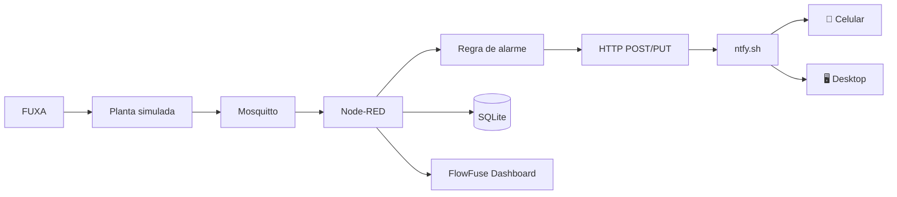
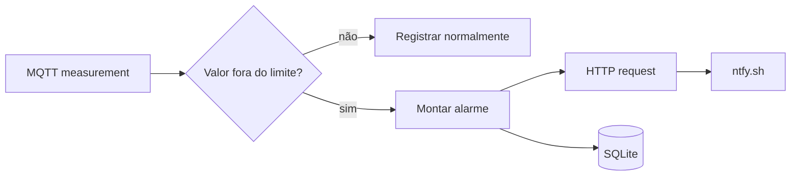
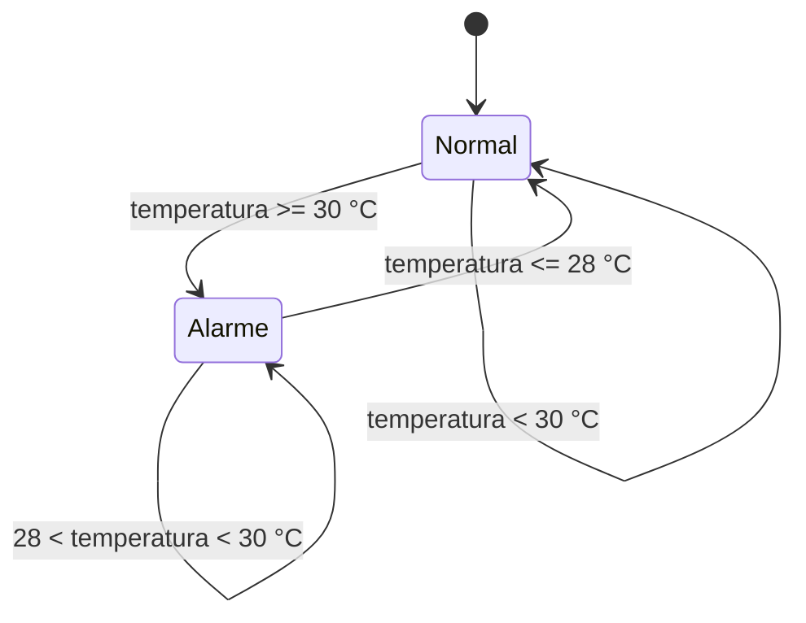

# 09 — Notificações e alarmes com ntfy

Nesta prática acrescentamos uma camada de **notificação push** ao laboratório. O objetivo é separar claramente três funções:

- **FUXA:** supervisão e HMI;
- **Node-RED:** regras de automação e geração de alarmes;
- **ntfy:** entrega da notificação para celular ou desktop.

O serviço `ntfy.sh` aceita mensagens HTTP usando `PUT` ou `POST`, portanto pode ser acionado diretamente pelo Node-RED com o nó **HTTP request**.

:::warning[Uso didático]
Os tópicos públicos do serviço `ntfy.sh` não devem receber informações confidenciais. Para uma aula, use um tópico com nome suficientemente aleatório. Para uma instalação real, considere autenticação, ACLs ou uma instância própria do ntfy.
:::

## 1. Arquitetura



## 2. Criar o tópico

Escolha um tópico que não seja previsível. Por exemplo:

```text
scada-lab-adriano-2026-x7k91
```

O endpoint será:

```text
https://ntfy.sh/scada-lab-adriano-2026-x7k91
```

Não publique o tópico real em um repositório público se ele for utilizado para informações que você não deseja que terceiros descubram ou publiquem.

## 3. Configurar o celular ou desktop

Instale o aplicativo ntfy ou utilize a interface web. Inscreva-se no tópico criado.

Faça primeiro um teste manual:

```bash
curl -d "Teste SCADA Lab" https://ntfy.sh/scada-lab-adriano-2026-x7k91
```

Se a assinatura estiver correta, a mensagem deverá aparecer no dispositivo.

## 4. Configurar o Node-RED

No fluxo do laboratório, o alarme pode ser construído desta forma:



### 4.1 Variável de ambiente

No `.env` do projeto:

```env
NTFY_TOPIC=scada-lab-seu-topico
NTFY_SERVER=https://ntfy.sh
```

O `docker-compose.yml` passa essas variáveis ao Node-RED.

### 4.2 Configuração do nó HTTP request

Use:

```text
Method: use msg.method
URL: use msg.url
Return: a parsed JSON object
```

O nó anterior deve produzir:

```javascript
msg.method = "POST";
msg.url = env.get("NTFY_SERVER") + "/" + env.get("NTFY_TOPIC");
msg.headers = {
  Title: "SCADA Lab - Alarme",
  Priority: "4",
  Tags: "warning",
};
msg.payload = "Temperatura acima do limite";
return msg;
```

## 5. Teste pelo Node-RED

O fluxo fornecido pelo laboratório contém um teste de alarme. Abra o Node-RED:

```text
http://localhost:1880
```

Localize a aba **SCADA Lab** e pressione o inject correspondente ao teste ntfy.

A mensagem deverá seguir:

```text
Node-RED → HTTP → ntfy.sh → celular/desktop
```

## 6. Alarme baseado em temperatura

Uma regra simples para a aula:

```javascript
const temperature = Number(msg.value);

if (!Number.isFinite(temperature)) {
  return null;
}

if (temperature <= 30) {
  return null;
}

msg.method = "POST";
msg.url = env.get("NTFY_SERVER") + "/" + env.get("NTFY_TOPIC");
msg.headers = {
  Title: "SCADA Lab - Alta temperatura",
  Priority: "4",
  Tags: "warning,thermometer",
};
msg.payload = `Temperatura do tanque: ${temperature.toFixed(1)} °C`;
return msg;
```

:::tip[Evite tempestade de notificações]
Em uma aplicação real, não envie uma notificação a cada mensagem MQTT enquanto a condição permanecer verdadeira. Use **detecção de borda**, temporização, hysteresis ou estado do alarme para notificar apenas a transição `NORMAL → ALARM` e, opcionalmente, `ALARM → NORMAL`.
:::

## 7. Alarme com hysteresis

Para uma temperatura:

```text
ALARME:     >= 30 °C
NORMALIZA:  <= 28 °C
```



Esse mecanismo evita que pequenas oscilações em torno de 30 °C produzam dezenas de notificações.

## 8. Exercício

Implemente três alarmes:

| Variável    |         Condição de alarme |       Recuperação |
| ----------- | -------------------------: | ----------------: |
| Temperature |                 `>= 30 °C` |        `<= 28 °C` |
| Level       |                  `<= 20 %` |         `>= 25 %` |
| PumpSpeed   | `== 0` com bomba comandada | bomba funcionando |

Cada alarme deve possuir:

1. indicação visual no Dashboard;
2. registro no SQLite;
3. notificação no ntfy;
4. mensagem de recuperação.

## 9. Desafio

Modifique o fluxo para incluir no alerta:

```text
Planta
Variável
Valor atual
Limite
Data/hora
Estado
```

Exemplo:

```text
🚨 SCADA LAB
Planta: Tank-01
Variável: Temperature
Valor: 31.4 °C
Limite: 30.0 °C
Estado: ALARM
```

## 10. Critérios de conclusão

A prática está concluída quando:

- [ ] o dispositivo recebe uma mensagem de teste;
- [ ] o Node-RED gera uma notificação automaticamente;
- [ ] o alarme é registrado no SQLite;
- [ ] o Dashboard mostra o estado do alarme;
- [ ] a recuperação também gera uma notificação;
- [ ] o aluno consegue explicar a diferença entre **supervisão**, **automação**, **histórico** e **notificação**.
