# Guia do LAB IoT

Este guia explica como montar o laboratório da disciplina com o script
**`gen_iot_scada_ntfy_portal.py`** e como usá-lo no dia a dia.

- **[Parte 1 — Professor](#parte-1--professor)**: preparar o servidor do laboratório (Windows 11)
  e o VPS, gerar o ambiente, publicar na internet, entregar os acessos pelo GitHub, gerar os kits
  dos grupos e administrar o lab.
- **[Parte 2 — Aluno](#parte-2--aluno)**: acessar no laboratório ou de casa, programar no
  Node-RED, montar telas SCADA no FUXA, usar MQTT, compartilhar código no wastebin, receber avisos no
  celular (ntfy), versionar no Gitea e rodar o kit do grupo no próprio computador.

:::info[Visão geral em uma frase]
Todos os serviços rodam **no servidor do laboratório** (Windows 11 + Docker Desktop). Na rede do
laboratório, o acesso é direto pelo IP (`http://192.168.0.102/`). De qualquer outro lugar, o acesso é
por **`https://iot.adrianoruseler.com/`**: um **túnel SSH** que **sai** do laboratório leva as
requisições do **Apache do VPS** até o portal. Nenhuma porta precisa ser aberta na rede da instituição.
Opcionalmente, cada grupo recebe um **kit** com o mesmo ambiente para rodar na própria máquina.
:::

## Arquitetura

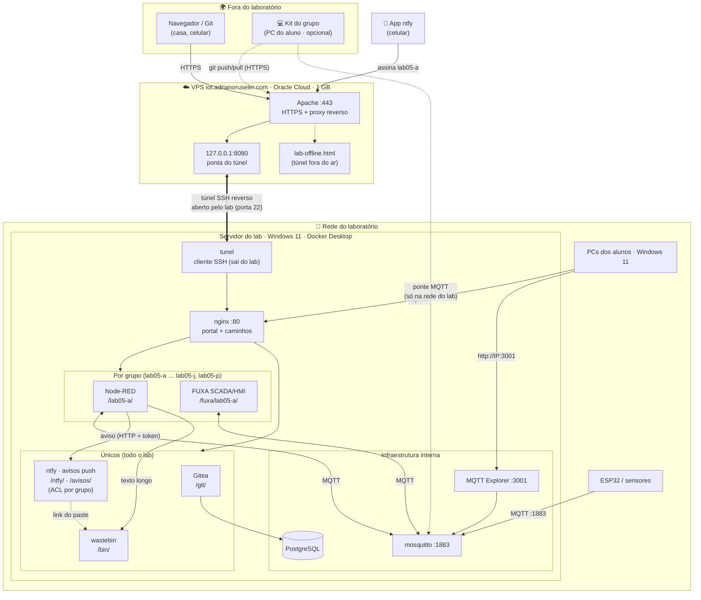

### Dois endereços, o mesmo laboratório

| Onde você está              | Endereço base                           | Observações                                     |
| --------------------------- | --------------------------------------- | ----------------------------------------------- |
| **Na rede do laboratório**  | `http://192.168.0.102` (IP do servidor) | mais rápido; não depende da internet nem do VPS |
| **Em qualquer outro lugar** | `https://iot.adrianoruseler.com`        | HTTPS; só funciona com o servidor do lab ligado |

Os serviços ficam em **caminhos** do endereço base, iguais nos dois casos:

| Serviço                                            | Caminho              | No lab | De fora |
| -------------------------------------------------- | -------------------- | ------ | ------- |
| Portal                                             | `/`                  | ✅     | ✅      |
| Node-RED do grupo A                                | `/lab05-a/`          | ✅     | ✅      |
| Dashboard do grupo A                               | `/lab05-a/dashboard` | ✅     | ✅      |
| FUXA (SCADA/HMI) do grupo A                        | `/fuxa/lab05-a/`     | ✅     | ✅      |
| Gitea                                              | `/git/`              | ✅     | ✅      |
| wastebin (colar código)                            | `/bin/`              | ✅     | ✅      |
| Avisos (página web do ntfy)                        | `/avisos/`           | ✅     | ✅      |
| ntfy (servidor para o app do celular e o Node-RED) | `/ntfy`              | ✅     | ✅      |
| MQTT Explorer                                      | porta `3001`         | ✅     | ❌      |
| Broker MQTT                                        | porta `1883`         | ✅     | ❌      |

### Convenção de nomes

O nome do lab (`--lab`, padrão `lab05`) é combinado com uma letra:

| Item                  | Nome                                            | Observação                                           |
| --------------------- | ----------------------------------------------- | ---------------------------------------------------- |
| Grupos de alunos      | `lab05-a`, `lab05-b`, …                         | um por grupo (máx. 24)                               |
| Professor             | `lab05-p`                                       | letra **p** reservada                                |
| Painel de notas       | `lab05-n`                                       | letra **n** reservada                                |
| Organização no Gitea  | `lab05-grupo-a`, …                              | uma por grupo                                        |
| Repositório no GitHub | `ELT85B-N21-2026-2/lab05-grupo-a`, …            | já existentes; recebem os acessos                    |
| FUXA do grupo         | `/fuxa/lab05-a/`, container `lab05-a-fuxa`      | um por grupo + professor                             |
| Tópicos do ntfy       | `lab05-a` e `lab05-a-*` (ex.: `lab05-a-alarme`) | só o grupo lê/escreve; `lab05-avisos` é do professor |
| Tópicos MQTT do grupo | `lab05-a/...`                                   | prefixo obrigatório por convenção                    |
| Kit do grupo          | `lab05-kits\lab05-a.zip`                        | mesmo ambiente, na máquina do aluno                  |

---

## Parte 1 — Professor

### 1. Visão geral da preparação

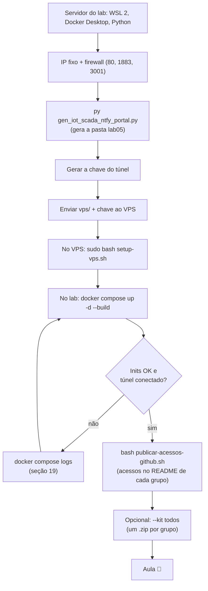

### 2. Preparar o servidor do laboratório (Windows 11)

#### 2.1 Hardware recomendado

| Recurso     | Mínimo                   | Recomendado       |
| ----------- | ------------------------ | ----------------- |
| Memória RAM | 8 GB                     | **16 GB** ou mais |
| Disco livre | 20 GB                    | 40 GB (SSD)       |
| Rede        | cabo, na rede dos alunos | cabo + IP fixo    |

Consumo aproximado com 10 grupos:

| Serviço                                          | Instâncias                      | RAM aproximada   |
| ------------------------------------------------ | ------------------------------- | ---------------- |
| Node-RED                                         | 12 (grupos + professor + notas) | ~100 MB cada     |
| FUXA                                             | 11 (grupos + professor)         | ~130 MB cada     |
| Gitea + PostgreSQL                               | 1                               | ~400 MB          |
| ntfy                                             | 1 (todo o lab)                  | ~30 MB           |
| nginx, mosquitto, wastebin, MQTT Explorer, túnel | 1 cada                          | ~200 MB no total |
| **Total**                                        |                                 | **~3,5 GB**      |

#### 2.2 Instalar os programas

No **PowerShell como administrador**:

```powershell
wsl --install                          # WSL 2 (reinicie se for pedido)
winget install -e --id Docker.DockerDesktop
winget install -e --id Python.Python.3.12
winget install -e --id Git.Git         # traz o Git Bash (usado para publicar os acessos)
winget install -e --id GitHub.cli      # gh: publica os acessos nos repositórios dos grupos
```

Reinicie o computador e abra o **Docker Desktop** uma vez. Em **Settings → General**, marque
_Use the WSL 2 based engine_ e _Start Docker Desktop when you sign in_. Depois, num PowerShell comum:

```powershell
py -m pip install bcrypt
docker version; docker compose version; py --version
gh auth login                          # conta com escrita nos repositórios da organização
```

:::warning[Energia e suspensão]
O servidor não pode suspender durante a aula, nem quando os alunos acessam de casa. Em
**Configurações → Sistema → Energia**, ajuste a suspensão para **Nunca** quando estiver na tomada.
:::

#### 2.3 Imagem do MQTT Explorer

O laboratório usa a imagem local **`ruseler/mqtt-explorer:local`**, que precisa existir no servidor:

```powershell
docker image ls ruseler/mqtt-explorer          # deve listar a tag "local"
# vinda de outro computador:
docker save -o mqtt-explorer.tar ruseler/mqtt-explorer:local   # na origem
docker load -i mqtt-explorer.tar                                # no servidor
```

#### 2.4 IP fixo, perfil de rede e firewall

1. Descubra o IP com `ipconfig` (**Endereço IPv4**, por exemplo `192.168.0.102`).
2. Fixe-o por **reserva de DHCP** no roteador ou em **Configurações → Rede e Internet → Ethernet →
   Atribuição de IP → Manual**.
3. Deixe a rede como **Privada** e libere as portas usadas **dentro do laboratório**. No PowerShell
   como administrador:

```powershell
Set-NetConnectionProfile -InterfaceAlias "Ethernet" -NetworkCategory Private

New-NetFirewallRule -DisplayName "LAB IoT - HTTP (portal)" -Direction Inbound -Protocol TCP -LocalPort 80   -Action Allow -Profile Private
New-NetFirewallRule -DisplayName "LAB IoT - MQTT"          -Direction Inbound -Protocol TCP -LocalPort 1883 -Action Allow -Profile Private
New-NetFirewallRule -DisplayName "LAB IoT - MQTT Explorer" -Direction Inbound -Protocol TCP -LocalPort 3001 -Action Allow -Profile Private
```

:::tip[O túnel não precisa de porta aberta]
O túnel é uma conexão **de saída** (SSH, porta 22) do servidor do lab até o VPS. Basta que a rede da
instituição permita sair para a porta 22 do VPS. Não é preciso redirecionar portas no roteador nem
pedir liberação de entrada.
:::

### 3. Preparar o VPS

O VPS **não roda** os serviços. Ele só recebe o HTTPS e repassa pelo túnel, o que cabe
folgado em 1 GB de RAM.

Antes de começar, confira:

| Requisito                                                                        | Como verificar no VPS                                           |
| -------------------------------------------------------------------------------- | --------------------------------------------------------------- |
| Apache servindo **HTTPS** para `iot.adrianoruseler.com` (certificado do certbot) | `sudo apache2ctl -S` lista um VirtualHost `*:443` com esse nome |
| Acesso SSH com `sudo` (usuário `ubuntu` na Oracle)                               | `ssh ubuntu@iot.adrianoruseler.com`                             |
| Portas **22** e **443** abertas (Security List da Oracle + firewall)             | já usadas hoje para SSH e o site                                |
| `python3` e `curl`                                                               | já vêm no Ubuntu                                                |

Se ainda não houver certificado:

```bash
sudo certbot --apache -d iot.adrianoruseler.com
```

:::caution[A raiz do domínio passa a ser o laboratório]
Depois do setup, **todo** o `https://iot.adrianoruseler.com/` é encaminhado ao laboratório. Se esse
domínio já mostra outro conteúdo, ele deixa de aparecer. As exceções são a validação do certbot
(`/.well-known/acme-challenge/`) e a página `lab-offline.html`.
:::

### 4. Gerar o ambiente

Coloque o `gen_iot_scada_ntfy_portal.py` em `C:\lab`, abra o PowerShell nessa pasta e rode:

```powershell
cd C:\lab
py .\gen_iot_scada_ntfy_portal.py --lab lab05 --grupos 10 --ip 192.168.0.102
```

O script **não sobe nada**: ele só gera os arquivos em `C:\lab\lab05`. Saída (resumida):

```text
🐳 docker-compose.yml
🌐 nginx/nginx.conf
🔔 ntfy/server.yml
🏭 fuxa/<grupo>/appdata (usuários e configurações do FUXA)
🏠 nginx/html/index.html
🔔 nginx/html/avisos/index.html
🐙 gitea/init/gitea-init.sh
🐘 postgres/init/bancos.sql
🔐 tunel/  e  🌍 vps/ (proxy.conf, lab-offline.html, setup-vps.sh)
🐙 acessos/<grupo>.md + publicar-acessos-github.sh (GitHub: ELT85B-N21-2026-2)

✅ lab05: 10 grupos (lab05-a..lab05-j) + professor (lab05-p) + notas (lab05-n)

  Local:   http://192.168.0.102/
  Público: https://iot.adrianoruseler.com/   (túnel SSH -> Apache do VPS iot.adrianoruseler.com)
  Grupo A: <base>/lab05-a/   ·   Gitea: <base>/git/   ·   wastebin: <base>/bin/
  MQTT Explorer: http://192.168.0.102:3001/   ·   MQTT: 192.168.0.102:1883  (rede local)
  FUXA:   <base>/fuxa/lab05-a/ (SCADA/HMI do grupo; 11 instâncias)
  ntfy:   <base>/avisos/ (página)  ·  app: <base>/ntfy  ·  tópicos lab05-a, lab05-a-*, lab05-avisos
```

:::tip[Pasta curta e sem OneDrive]
Use uma pasta local e curta como `C:\lab`. Evite **Área de Trabalho** e **Documentos** se estiverem
sincronizados com o OneDrive, porque a sincronização pode travar arquivos usados pelos containers.
:::

#### 4.1 Todos os parâmetros

| Parâmetro                                           | Padrão                           | O que faz                                                                                                                  |
| --------------------------------------------------- | -------------------------------- | -------------------------------------------------------------------------------------------------------------------------- |
| `--lab`                                             | `lab05`                          | Nome do lab; prefixo de tudo (deve começar com letra).                                                                     |
| `--grupos`                                          | `10`                             | Quantidade de grupos (1 a 24).                                                                                             |
| `--ip`                                              | `127.0.0.1`                      | **IP do servidor na rede do lab** (acesso local, MQTT, MQTT Explorer).                                                     |
| `--publico-url`                                     | `https://iot.adrianoruseler.com` | Endereço público servido pelo Apache do VPS.                                                                               |
| `--vps-host`                                        | host da `--publico-url`          | Host ou IP do VPS para o SSH do túnel.                                                                                     |
| `--vps-ssh-porta`                                   | `22`                             | Porta SSH do VPS.                                                                                                          |
| `--vps-usuario`                                     | `tunel`                          | Usuário restrito criado no VPS para o túnel.                                                                               |
| `--vps-porta-tunel`                                 | `8080`                           | Porta, **só em 127.0.0.1 do VPS**, onde o túnel entrega o portal.                                                          |
| `--sem-tunel`                                       | desligado                        | Sem publicação: só a rede local (`http://IP/`).                                                                            |
| `--sem-gitea`                                       | desligado                        | Não inclui o Gitea.                                                                                                        |
| `--gitea-db`                                        | `postgres`                       | Banco do Gitea: `postgres` ou `sqlite` (sem PostgreSQL).                                                                   |
| `--gitea-repo`                                      | `nodered`                        | Repositório criado em cada organização (`''` = nenhum).                                                                    |
| `--sem-fuxa`                                        | desligado                        | Não inclui o FUXA (SCADA/HMI).                                                                                             |
| `--sem-wastebin`                                    | desligado                        | Não inclui o wastebin (`/bin/`).                                                                                           |
| `--sem-ntfy`                                        | desligado                        | Não inclui o ntfy (avisos push em `/ntfy` e `/avisos/`).                                                                   |
| `--proteger-http`                                   | desligado                        | Dashboards/endpoints HTTP do Node-RED **e as telas do FUXA** passam a pedir o login do grupo.                              |
| `--novas-senhas`                                    | desligado                        | Sorteia senhas **novas** para todos (por padrão, as senhas são mantidas).                                                  |
| `--github-org`                                      | `ELT85B-N21-2026-2`              | Organização do GitHub com os repositórios `lab05-grupo-<letra>`.                                                           |
| `--dominio`                                         | `iot.lab`                        | Usado só nos e-mails internos das contas (`lab05-a@iot.lab`).                                                              |
| `--saida`                                           | nome do lab                      | Pasta onde tudo é gerado.                                                                                                  |
| `--mqtt-explorer-auth`                              | desligado                        | Exige login no MQTT Explorer.                                                                                              |
| `--mqtt-explorer-usuario` / `--mqtt-explorer-senha` | `admin` / gerada                 | Credenciais do MQTT Explorer.                                                                                              |
| `--mqtt-explorer-porta`                             | `3001`                           | Porta do MQTT Explorer.                                                                                                    |
| `--kit`                                             | —                                | Gera o **kit de um grupo** (`a` ou `lab05-a`) ou de todos (`todos`). Veja a [seção 15](#15-kit-do-grupo-máquina-do-aluno). |
| `--ponte-mqtt`                                      | —                                | Kit: liga o broker do kit ao do lab (`192.168.0.102` ou `host:porta`).                                                     |
| `--porta-http`                                      | `80`                             | Kit: porta do portal na máquina do aluno.                                                                                  |
| `--segredos`                                        | `lab05\.segredos.json`           | Kit: de onde reaproveitar as senhas do grupo.                                                                              |

:::warning[Não esqueça o --ip]
Com o padrão `127.0.0.1`, o lab só funciona **no próprio servidor**. Sempre gere com o IP real da
rede do laboratório.
:::

#### 4.2 Outros exemplos

```powershell
# Dashboards e telas do FUXA protegidos por senha
py .\gen_iot_scada_ntfy_portal.py --lab lab05 --ip 192.168.0.102 --proteger-http

# Laboratório enxuto: sem FUXA e Gitea em SQLite (não cria o PostgreSQL)
py .\gen_iot_scada_ntfy_portal.py --lab lab05 --ip 192.168.0.102 --sem-fuxa --gitea-db sqlite

# Só rede local, sem VPS
py .\gen_iot_scada_ntfy_portal.py --lab lab05 --ip 192.168.0.102 --sem-tunel

# Kits de todos os grupos (lab05-kits\lab05-a.zip, ...)
py .\gen_iot_scada_ntfy_portal.py --lab lab05 --grupos 10 --kit todos
```

### 5. O que foi gerado

```text
lab05\
├── docker-compose.yml           # todos os serviços (inclui o "tunel")
├── Dockerfile                   # imagem do Node-RED com nós extras
├── credenciais.txt              # ⚠️ senhas e endereços de todos
├── .segredos.json               # ⚠️ senhas e chaves persistentes — NÃO apague
├── nginx\nginx.conf             # um servidor, tudo em caminhos
├── nginx\htpasswd               # login do wastebin (todos os usuários)
├── nginx\html\index.html        # portal (links relativos: valem no IP e no domínio)
├── nginx\html\avisos\           # página do ntfy + exemplo-node-red.json (ntfy + wastebin)
├── ntfy\server.yml              # ntfy: usuários, ACL por grupo e tokens do Node-RED
├── settings\lab05-a.js ...      # configuração de cada Node-RED
├── data\lab05-a\ ...            # fluxos, projetos e bancos SQLite de cada grupo
├── fuxa\lab05-a\ ...            # FUXA de cada grupo
│   ├── appdata\                 #   projeto, usuários e configurações
│   ├── db\                      #   históricos (DAQ), alarmes
│   └── images\                  #   imagens enviadas
├── mosquitto\  mqtt-explorer\   # broker e explorer
├── gitea\init\gitea-init.sh     # usuários, organizações, times e repositórios
├── postgres\init\bancos.sql     # banco do Gitea
├── acessos\lab05-a.md ...       # página de acesso de cada grupo (vai para o GitHub)
├── publicar-acessos-github.sh   # injeta acessos\ nos repositórios do GitHub
├── tunel\                       # cliente do túnel SSH
│   ├── Dockerfile, entrypoint.sh
│   └── chave\                   # ⚠️ chave privada do túnel (gerada no 1º uso)
└── vps\                         # vai para o VPS
    ├── setup-vps.sh             # configura usuário, sshd e Apache
    ├── proxy.conf               # trecho do Apache (proxy + WebSocket)
    └── lab-offline.html         # página "laboratório desligado"
```

Banco do Gitea, repositórios Git, pastes do wastebin e o histórico do ntfy ficam em **volumes do Docker**
(`lab05_postgres_data`, `lab05_gitea_data`, `lab05_wastebin_data`, `lab05_ntfy_data`,
`lab05_mosquitto_data`). O Node-RED e o FUXA ficam em pastas comuns (`data\` e `fuxa\`). O backup
está na [seção 17.1](#171-backup).

### 6. Publicar no VPS

Faça isto **uma vez**, no PowerShell, dentro de `C:\lab\lab05`. O Windows 11 já traz `ssh` e `scp`.

**1) Gerar a chave do túnel**

```powershell
docker compose run --rm --no-deps --build tunel chave
```

A chave fica em `tunel\chave\`. A linha `ssh-ed25519 …` exibida é a parte **pública**.

**2) Enviar os arquivos ao VPS**

```powershell
ssh ubuntu@iot.adrianoruseler.com mkdir -p iot-lab
scp -r vps tunel\chave\id_ed25519.pub ubuntu@iot.adrianoruseler.com:iot-lab/
```

**3) Rodar o setup no VPS**

```powershell
ssh -t ubuntu@iot.adrianoruseler.com sudo bash iot-lab/vps/setup-vps.sh iot-lab/id_ed25519.pub
```

```text
[setup-vps] usuário tunel criado
[setup-vps] chave do túnel autorizada (só 127.0.0.1:8080)
[setup-vps] sshd recarregado
[setup-vps] MPM event: limite de conexões simultâneas ajustado para 400
[setup-vps] VirtualHost HTTPS: /etc/apache2/sites-available/iot.adrianoruseler.com-le-ssl.conf
[setup-vps] Include inserido (backup: ...-le-ssl.conf.bak-iot-lab-20261001110743)
[setup-vps] Apache recarregado
[setup-vps] OK: Apache pronto; o túnel ainda não está conectado (página 'laboratório desligado').
```

O `setup-vps.sh` pode rodar de novo quantas vezes for preciso (por exemplo, para trocar a chave).
Ele faz o seguinte:

| Etapa           | O que faz                                                                                                   | Por quê                                                         |
| --------------- | ----------------------------------------------------------------------------------------------------------- | --------------------------------------------------------------- |
| Usuário `tunel` | sem senha nem shell; a chave só pode abrir `127.0.0.1:8080`                                                 | se a chave vazar, não dá acesso ao VPS                          |
| sshd            | regras só para `tunel` e detecção de conexão morta a cada 15 s                                              | libera a porta rápido após uma queda                            |
| Apache          | liga `proxy`, `proxy_http`, `proxy_wstunnel`, `headers` e insere o `Include` no VirtualHost 443, com backup | encaminhar HTTPS e WebSocket                                    |
| MPM event       | até 400 conexões simultâneas                                                                                | cada editor, tela do FUXA e dashboard aberto mantém uma conexão |
| Validação       | `apache2ctl configtest`; se falhar, **restaura o backup**                                                   | não derrubar o site                                             |

**4) Subir o laboratório** (próxima seção)

#### Como uma requisição chega ao serviço do grupo

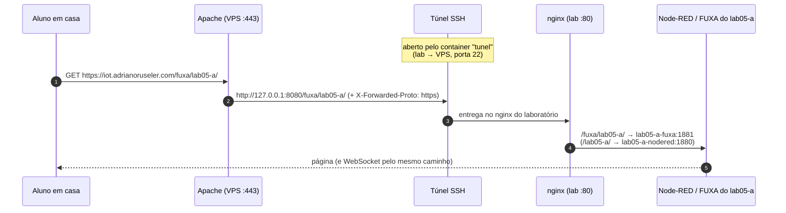

### 7. Subir o laboratório

```powershell
cd C:\lab\lab05
docker compose up -d --build
```

A primeira subida leva vários minutos (monta a imagem do Node-RED e baixa as demais). A ordem de
inicialização é:

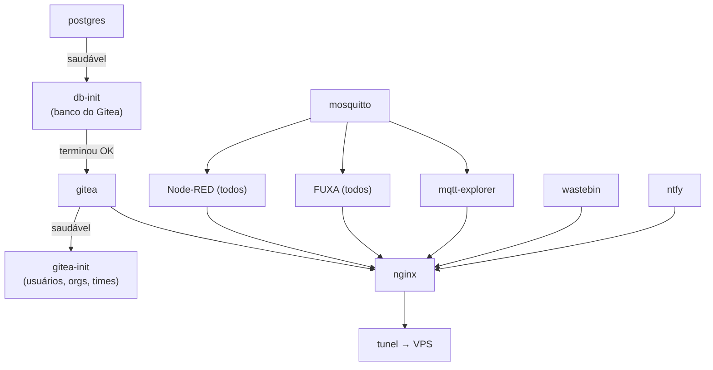

Confira o estado e os logs:

```powershell
docker compose ps -a                       # db-init e gitea-init: "exited (0)"
docker compose logs gitea-init
docker compose logs -f tunel
```

```text
[tunel] chave pública: ssh-ed25519 AAAAC3Nza... tunel-iot-lab
[tunel] conectando tunel@iot.adrianoruseler.com:22  (VPS 127.0.0.1:8080 -> nginx:80)
Warning: Permanently added 'iot.adrianoruseler.com' (ED25519) to the list of known hosts.
```

Sem novas mensagens depois de "conectando", o túnel está **no ar**. Se ele cair, o container tenta
de novo a cada 10 s.

### 8. Verificar

| Teste                                                                     | Onde              | Esperado                                                                             |
| ------------------------------------------------------------------------- | ----------------- | ------------------------------------------------------------------------------------ |
| `http://192.168.0.102/`                                                   | PC na rede do lab | portal com os cartões e a linha "FUXA de cada grupo"                                 |
| `https://iot.adrianoruseler.com/`                                         | celular no 4G     | o mesmo portal, com cadeado                                                          |
| `https://iot.adrianoruseler.com/` com o lab desligado                     | qualquer lugar    | página **"O laboratório está desligado no momento"**                                 |
| `/fuxa/lab05-a/`                                                          | qualquer lugar    | FUXA abre; login com `lab05-a` permite editar; `admin`/`123456` **não** entra        |
| `/bin/`                                                                   | qualquer lugar    | pede login (usuário/senha de qualquer grupo)                                         |
| `http://192.168.0.102:3001/`                                              | rede do lab       | MQTT Explorer                                                                        |
| `/avisos/`                                                                | qualquer lugar    | login com `lab05-a`; publicar em `lab05-a` funciona, em `lab05-b` dá "Sem permissão" |
| `curl -u lab05-a:SENHA -d oi https://iot.adrianoruseler.com/ntfy/lab05-a` | qualquer lugar    | JSON com `"event":"message"`                                                         |
| `/robots.txt`                                                             | qualquer lugar    | `Disallow: /`                                                                        |

### 9. Credenciais

O `credenciais.txt` traz as senhas e **os dois endereços** de cada serviço. **Um par
usuário/senha por grupo** vale para Node-RED, FUXA, Gitea, wastebin e ntfy:

| Usuário               | Node-RED                | FUXA                      | Gitea                                | wastebin | ntfy                                                  |
| --------------------- | ----------------------- | ------------------------- | ------------------------------------ | -------- | ----------------------------------------------------- |
| `lab05-a`             | edita o próprio         | administra o do grupo     | escreve em `lab05-grupo-a`           | ✅       | lê/escreve `lab05-a`, `lab05-a-*`; lê `lab05-avisos`  |
| `lab05-a-view`        | só visualiza            | —                         | —                                    | —        | —                                                     |
| `lab05-p` (professor) | edita o do professor    | administra **todos**      | **administrador**                    | ✅       | **admin**: publica em `lab05-avisos`, lê/escreve tudo |
| `lab05-n` (notas)     | edita o painel de notas | — (vê as telas sem login) | **leitura** em todas as organizações | ✅       | **lê** todos os tópicos `lab05-*`                     |

Além da senha, cada usuário tem um **token do ntfy** (`tk_…`, no `credenciais.txt`), já entregue ao
Node-RED do grupo pela variável `NTFY_TOKEN`.

As senhas são **mantidas** quando o script roda de novo (ficam em `.segredos.json`). Para
sortear novas, use `--novas-senhas`.

:::danger[Proteja credenciais.txt, .segredos.json e tunel\chave]
Os três contêm segredos em texto puro. Não os coloque em repositório, em OneDrive compartilhado nem
em pasta acessível aos alunos. Para entregar as senhas, use os repositórios privados de cada grupo
(próxima seção).
:::

#### 9.1 Entregar os acessos pelo GitHub

Cada grupo já tem um repositório **privado** no GitHub (`ELT85B-N21-2026-2/lab05-grupo-a`, …), ao qual
só o grupo e o professor têm acesso. O script gera, em `acessos\`, uma página por grupo (usuário,
senha, endereços e configurações do Node-RED/FUXA) e o **`publicar-acessos-github.sh`**, que a injeta
no **topo do README.md** de cada repositório, entre marcadores. O resto do README fica intacto, e as
execuções seguintes só substituem esse bloco.

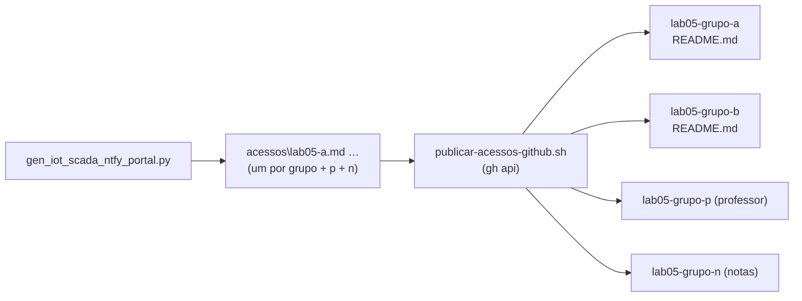

No **Git Bash**, dentro de `C:\lab\lab05`:

```bash
bash publicar-acessos-github.sh --dry-run     # mostra o que faria
bash publicar-acessos-github.sh               # publica em todos
```

| Opção            | O que faz                                            |
| ---------------- | ---------------------------------------------------- |
| (nenhuma)        | bloco no topo do `README.md`                         |
| `--arquivo`      | arquivo separado `ACESSO-LAB05.md` (README intocado) |
| `--remover`      | retira o bloco e/ou o arquivo (fim do semestre)      |
| `--grupos "a b"` | só esses grupos                                      |
| `--org NOME`     | outra organização do GitHub                          |
| `--dry-run`      | não altera nada                                      |

Os commits levam `[skip ci]` (não disparam GitHub Actions) e respeitam o fim de linha CRLF de
READMEs criados no Windows. Rode de novo sempre que regerar com `--novas-senhas`.

### 10. Gitea

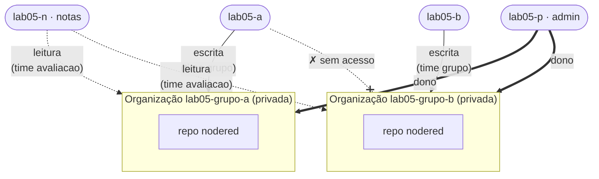

O `gitea-init` cria, para cada grupo, o usuário (mesma senha do Node-RED), a organização privada,
os times `grupo` (escrita) e `avaliacao` (leitura, para `lab05-n`) e o repositório `nodered` com
`README.md` na branch `main`. O cadastro público fica desligado e é preciso login até para ver.

A imagem do Gitea fica fixada na versão **28** (`gitea/gitea:28`), para que uma versão nova não mude o
comportamento no meio do semestre.

O endereço "oficial" do Gitea (links e URLs de clone exibidos) é o público,
`https://iot.adrianoruseler.com/git/`. Mesmo assim, ele **funciona normalmente pelo IP** dentro do
laboratório. É também por esse endereço público que os **kits** dos grupos sincronizam o projeto.

### 11. FUXA (SCADA/HMI)

O **[FUXA](https://github.com/frangoteam/FUXA)** é um SCADA/HMI web: telas com indicadores,
gráficos, botões, alarmes e históricos. No laboratório ele trabalha **junto com o Node-RED**: o
Node-RED faz a lógica (sensores, regras, banco, avisos) e o FUXA é a **tela de operação**. Os dois
conversam pelo **broker MQTT**, nos tópicos do grupo.

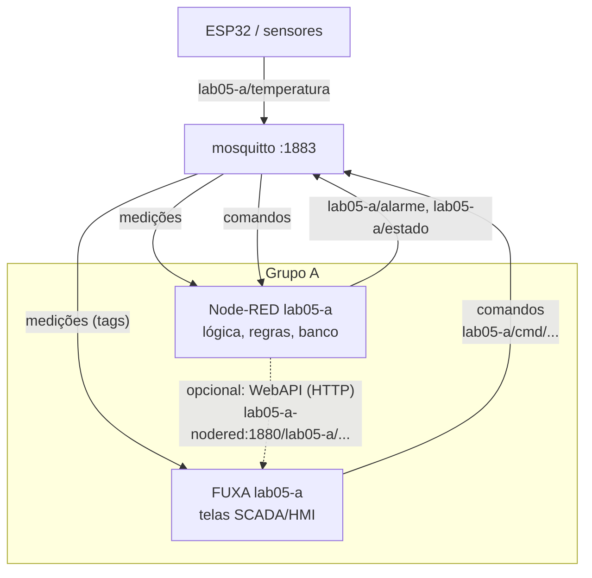

| Item                      | Como está configurado                                                                                                      |
| ------------------------- | -------------------------------------------------------------------------------------------------------------------------- |
| Instâncias                | uma por grupo + professor (`lab05-a-fuxa`, …, `lab05-p-fuxa`), imagem fixa `frangoteam/fuxa:1.3.4`                         |
| Endereço                  | `/fuxa/lab05-a/` (variável `BASE_PATH` do FUXA; WebSocket em `/fuxa/lab05-a/socket.io/`)                                   |
| Usuários                  | o grupo e o professor, ambos administradores; **não existe** o `admin`/`123456` padrão                                     |
| Segurança                 | editar exige login; **ver as telas não** (só leitura). Com `--proteger-http`, o nginx pede o login do grupo antes de abrir |
| Idioma                    | português (algumas telas do FUXA misturam inglês)                                                                          |
| Node-RED embutido do FUXA | **desligado**: cada grupo usa o próprio Node-RED, via MQTT                                                                 |
| Dados                     | `fuxa\lab05-a\appdata` (projeto e usuários), `db` (históricos), `images`                                                   |

O gerador **semeia** os usuários no banco do FUXA (`users.fuxap.db`) e grava `mysettings.json`
(segurança ligada, segredo do token, idioma). Rodar o script de novo **re-sincroniza as senhas**; o
projeto e usuários criados no próprio FUXA são mantidos.

:::tip[Professor: um login para todos os FUXA]
O usuário `lab05-p` administra o FUXA de todos os grupos. Para acompanhar um grupo, abra
`/fuxa/lab05-a/editor`. As telas de operação ficam em `/fuxa/lab05-a/home`.
:::

### 12. wastebin (colar e compartilhar código)

O **[wastebin](https://github.com/matze/wastebin)** é um "pastebin" único para todo o lab, em
**`/bin/`**: cola-se um trecho de código, um log ou um fluxo do Node-RED (JSON) e compartilha-se o
link. Útil para tirar dúvidas e trocar trechos entre grupos e com o professor.

| Item           | Como está configurado                                                              |
| -------------- | ---------------------------------------------------------------------------------- |
| Login          | usuário e senha de **qualquer** grupo (ou `lab05-p`/`lab05-n`), pedidos pelo nginx |
| Tamanho máximo | 2 MB por paste                                                                     |
| Validade       | 10 min, 1 h, 1 dia (padrão), 7 dias, 1 mês ou para sempre                          |
| Dados          | volume `lab05_wastebin_data` (SQLite)                                              |

O wastebin não tem painel de administração. Para listar ou apagar pastes, no servidor:

```powershell
docker exec lab05-wastebin /app/wastebin-ctl list
docker exec lab05-wastebin /app/wastebin-ctl delete <id>
```

### 13. Avisos push (ntfy)

O **[ntfy](https://ntfy.sh)** envia **notificações push** para o celular (app ntfy, Android e iOS) e
para o navegador. O Node-RED do grupo publica com um simples HTTP POST ("temperatura acima de 30 °C",
"porta aberta", "relatório pronto") e todos do grupo recebem no celular, no laboratório ou em casa.

:::info[Um único ntfy para todo o lab]
Não é preciso um ntfy por grupo (como era com o Mailpit). O ntfy tem **usuários e permissões por
tópico (ACL)**: com `auth-default-access: deny-all`, cada grupo só lê e escreve nos próprios tópicos.
Um serviço só usa ~30 MB de RAM e simplifica o app do celular (um servidor para todos).
:::

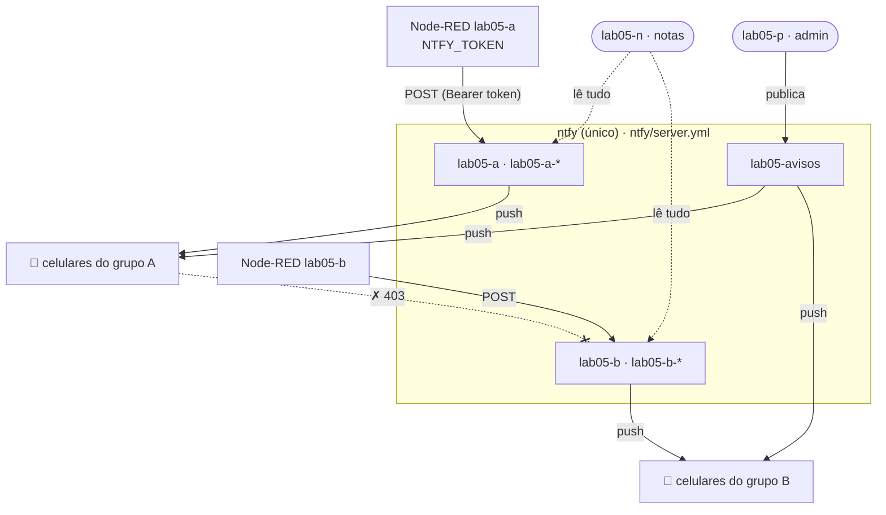

| Usuário                | Permissões no ntfy                                                            |
| ---------------------- | ----------------------------------------------------------------------------- |
| `lab05-a` (cada grupo) | lê/escreve `lab05-a` e `lab05-a-*` (ex.: `lab05-a-alarme`); lê `lab05-avisos` |
| `lab05-p` (professor)  | **admin**: lê/escreve tudo; publica os avisos da turma em `lab05-avisos`      |
| `lab05-n` (notas)      | lê todos os tópicos `lab05-*`                                                 |
| sem login              | nada (`deny-all`)                                                             |

Usuários, permissões e **tokens** são **declarativos** no `ntfy/server.yml` (gerado com as senhas do
`credenciais.txt`) e são re-sincronizados a cada subida. O `docker-compose.yml` tem um rótulo com o
hash desse arquivo: se uma senha muda, o `docker compose up -d` recria o ntfy sozinho.

**Endereços.** O ntfy não roda em subcaminho, então o nginx retira o `/ntfy` (API, WebSocket e
stream JSON funcionam normalmente):

| Para                               | Endereço                                                                                                    |
| ---------------------------------- | ----------------------------------------------------------------------------------------------------------- |
| App ntfy no celular (servidor)     | `https://iot.adrianoruseler.com/ntfy` (ou `http://192.168.0.102/ntfy` no lab)                               |
| Node-RED (interno, já configurado) | `http://ntfy` + token                                                                                       |
| Navegador                          | **`/avisos/`**: página do portal para ler e publicar (o app web do próprio ntfy não funciona em subcaminho) |

**Variáveis já definidas no Node-RED de cada grupo** (`env.get("...")` num nó _function_):

| Variável                                           | Exemplo (grupo A)                                |
| -------------------------------------------------- | ------------------------------------------------ |
| `NTFY_URL`                                         | `http://ntfy`                                    |
| `NTFY_TOPIC`                                       | `lab05-a`                                        |
| `NTFY_TOKEN`                                       | `tk_…` (do usuário `lab05-a`)                    |
| `NTFY_AVISOS`                                      | `lab05-avisos`                                   |
| `WASTEBIN_URL` / `WASTEBIN_LINK` / `WASTEBIN_AUTH` | wastebin interno / link público / login do grupo |
| `GRUPO`                                            | `lab05-a`                                        |

#### 13.1 ntfy + wastebin

Os dois não têm integração nativa (o wastebin não tem webhooks; o ntfy limita a mensagem a 4 KB),
mas se completam: **o texto longo vai para o wastebin e o aviso leva o link**. No celular, o aviso
mostra o resumo e um botão **"Abrir no wastebin"**.

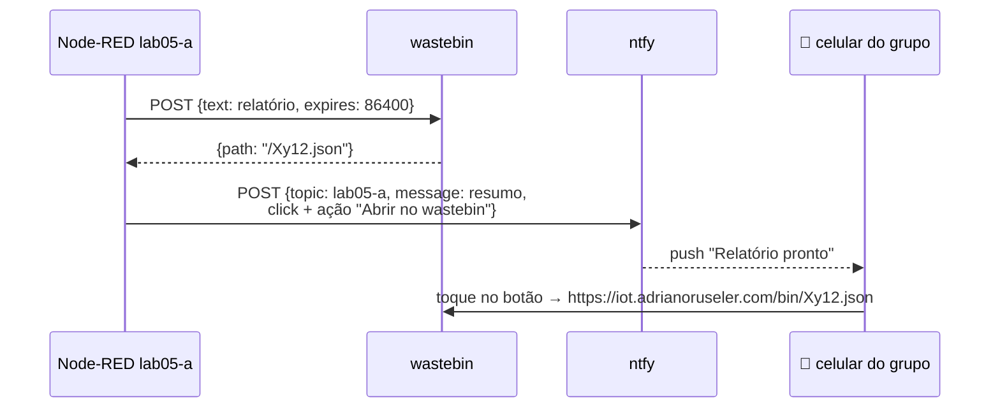

Isso já está pronto em dois lugares:

- **Página `/avisos/`**: ao publicar, marque _Texto longo: guardar no wastebin e mandar o link_ (ou
  publique mais de ~3,5 KB: vai para o wastebin automaticamente).
- **Fluxo de exemplo do Node-RED**: `/avisos/exemplo-node-red.json` (importar com _Menu → Import_),
  com "avisar (ntfy)" e "colar no wastebin → avisar com link". Usa só as variáveis acima, então o
  mesmo fluxo funciona para qualquer grupo e no kit.

:::note[iPhone]
Com servidor próprio, o app ntfy do **iOS** recebe as mensagens quando o app é aberto ou atualizado
em segundo plano, não instantaneamente (o push instantâneo do iOS depende do ntfy.sh e não funciona
com o servidor em subcaminho). No **Android** a entrega é imediata.
:::

### 14. Painel de notas (`lab05-n`)

O Node-RED de notas monta a pasta `data` de **todos** os grupos, só para leitura, em `/data_grupos`:

```text
/data_grupos/lab05-a/flows.json
/data_grupos/lab05-a/projects/nodered/flows.json   # se o grupo usa Projects
```

Use **read file** (ou `fs` num nó `function`) para analisar os fluxos. O usuário `lab05-n` também
tem leitura em todas as organizações do Gitea e em todos os tópicos `lab05-*` do ntfy.

### 15. Kit do grupo (máquina do aluno)

O **kit** é o ambiente de **um grupo** para rodar no computador do aluno (Windows 11 + Docker
Desktop): Node-RED, FUXA, broker MQTT e ntfy, com **os mesmos caminhos e os mesmos nomes
de serviço do laboratório**. Um fluxo ou uma tela feita em casa funciona no laboratório sem mudar
nada, e vice-versa.

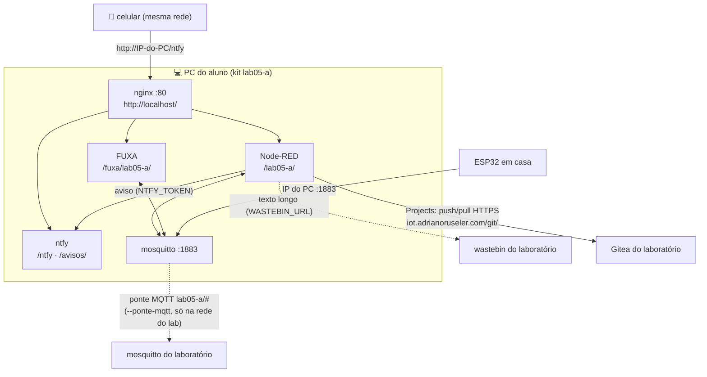

| No kit                                                                  | Igual ao laboratório?                                                            |
| ----------------------------------------------------------------------- | -------------------------------------------------------------------------------- |
| Caminhos `/lab05-a/`, `/fuxa/lab05-a/`, `/ntfy`, `/avisos/`             | ✅                                                                               |
| Nomes `mosquitto`, `ntfy`, `lab05-a-nodered`                            | ✅ (fluxos e conexões do FUXA valem nos dois)                                    |
| Variáveis `NTFY_URL`, `NTFY_TOPIC`, `NTFY_TOKEN`, `WASTEBIN_*`          | ✅ (o fluxo de exemplo roda igual; o wastebin é o do laboratório, pela internet) |
| Usuário e senha                                                         | ✅ a mesma do grupo (lida de `lab05\.segredos.json`)                             |
| `credentialSecret` do Node-RED                                          | ✅ o mesmo (credenciais dos nós continuam legíveis)                              |
| Gitea                                                                   | usa o **do laboratório**, pelo endereço público                                  |
| Professor/notas, wastebin próprio, `lab05-avisos`, MQTT Explorer, túnel | ❌ não fazem parte do kit                                                        |

**Gerar** (no servidor, em `C:\lab`, onde está a pasta `lab05`):

```powershell
py .\gen_iot_scada_ntfy_portal.py --lab lab05 --grupos 10 --kit todos      # todos os grupos
py .\gen_iot_scada_ntfy_portal.py --lab lab05 --kit a                      # só o grupo A
py .\gen_iot_scada_ntfy_portal.py --lab lab05 --kit a --ponte-mqtt 192.168.0.102   # com ponte MQTT
py .\gen_iot_scada_ntfy_portal.py --lab lab05 --kit a --porta-http 8080    # porta 80 ocupada no PC do aluno
```

```text
lab05-kits\
├── lab05-a\                 # docker-compose.yml, Dockerfile, nginx\, settings\, data\, fuxa\,
│   ├── LEIA-ME.md           #   mosquitto\, credenciais.txt e o passo a passo para o aluno
│   └── credenciais.txt
├── lab05-a.zip              # ⬅ entregue este arquivo ao grupo A
├── lab05-b.zip
└── ...
```

Entregue o `.zip` **só ao grupo** (ele contém a senha do grupo): pelo repositório privado do grupo no
GitHub (como _release_ ou arquivo), pelo Moodle ou pelo Teams. O aluno descompacta e roda
`docker compose up -d --build` ([Parte 2, seção 10](#10-kit-do-grupo-no-seu-computador)).

:::note[Ponte MQTT]
Com `--ponte-mqtt 192.168.0.102`, o broker do kit se liga ao do laboratório **somente nos tópicos
`lab05-a/#`**, nos dois sentidos: um ESP32 ligado ao notebook do aluno aparece no FUXA e no Node-RED
do grupo no servidor. Como a porta 1883 do laboratório não é publicada no VPS, a ponte só conecta
quando o notebook está **na rede do laboratório**; fora dela, o kit funciona normalmente e a ponte
tenta de novo a cada minuto.
:::

:::tip[Kit sem a pasta do lab]
Se o `.segredos.json` do lab não for encontrado (ou com `--novas-senhas`), o kit nasce com uma
**senha nova**, que vale só na máquina do aluno. O próprio aluno pode gerar o kit dessa forma, se
tiver Python e `bcrypt`.
:::

### 16. Segurança com o laboratório na internet

| Item                                        | Situação                                                                                                                                                        |
| ------------------------------------------- | --------------------------------------------------------------------------------------------------------------------------------------------------------------- |
| Editores Node-RED                           | exigem login (usuário do grupo ou `-view`)                                                                                                                      |
| FUXA                                        | editar exige login do grupo (ou do professor); **as telas podem ser vistas sem login**, a menos que use `--proteger-http`; o `admin`/`123456` padrão não existe |
| Gitea                                       | exige login; sem cadastro público                                                                                                                               |
| wastebin                                    | exige o login de algum usuário do lab (nginx)                                                                                                                   |
| **Dashboards e endpoints HTTP do Node-RED** | **abertos** por padrão. Use `--proteger-http` para pedir a senha do grupo. Nesse caso, um ESP32 que chame endpoints HTTP também precisa enviá-la.               |
| ntfy                                        | sem login não lê nem publica (`deny-all`); cada grupo só nos próprios tópicos; tokens só no Node-RED do grupo e no `credenciais.txt`                            |
| Broker MQTT e MQTT Explorer                 | **não** são publicados; só na rede do lab                                                                                                                       |
| Chave do túnel                              | só abre `127.0.0.1:8080` no VPS; não tem shell nem outros redirecionamentos                                                                                     |
| Buscadores e robôs de IA                    | `robots.txt` com `Disallow: /` e o Apache envia `X-Robots-Tag: noindex, nofollow`. Robôs bem-comportados respeitam; os outros só encontram telas de login.      |

As senhas dos grupos têm 8 caracteres. Com o laboratório exposto, evite reutilizá-las em outros
lugares e, ao final do semestre, desligue a publicação ([seção 17.3](#173-fim-do-semestre)).

### 17. Operação do dia a dia

No PowerShell, dentro de `C:\lab\lab05`:

| Tarefa                                   | Comando                                                                                         |
| ---------------------------------------- | ----------------------------------------------------------------------------------------------- |
| Ver status                               | `docker compose ps -a`                                                                          |
| Logs do túnel                            | `docker compose logs -f tunel`                                                                  |
| Reiniciar o túnel                        | `docker compose restart tunel`                                                                  |
| Tirar o lab da internet (continua local) | `docker compose stop tunel`                                                                     |
| Logs de um grupo                         | `docker compose logs -f lab05-a-nodered` / `lab05-a-fuxa`                                       |
| Reiniciar um grupo                       | `docker compose restart lab05-a-nodered lab05-a-fuxa`                                           |
| Parar tudo (mantém dados)                | `docker compose down`                                                                           |
| Subir de novo                            | `docker compose up -d`                                                                          |
| Ver mensagens MQTT                       | `docker exec -it lab05-mosquitto mosquitto_sub -t '#' -v`                                       |
| Recriar usuários do Gitea                | `docker compose run --rm gitea-init`                                                            |
| Logs do ntfy                             | `docker compose logs -f ntfy`                                                                   |
| Aviso para a turma                       | `curl -u lab05-p:SENHA -H "Title: Aviso" -d "Aula no lab 2" http://localhost/ntfy/lab05-avisos` |
| Recarregar o nginx (após regerar)        | `docker compose restart nginx`                                                                  |
| Republicar os acessos no GitHub          | `bash publicar-acessos-github.sh` (Git Bash)                                                    |

No VPS:

| Tarefa                       | Comando                                    |
| ---------------------------- | ------------------------------------------ |
| O túnel está conectado?      | `sudo ss -ltnp` e procure `127.0.0.1:8080` |
| Erros do Apache              | `sudo tail -f /var/log/apache2/error.log`  |
| Tentativas de login do túnel | `sudo journalctl -u ssh -f`                |

#### 17.1 Backup

```powershell
cd C:\lab\lab05
New-Item -ItemType Directory -Force backup | Out-Null
$d = Get-Date -Format yyyy-MM-dd

# Banco do Gitea: gerado dentro do container e copiado (evita UTF-16 do PowerShell)
docker exec lab05-postgres pg_dumpall -U postgres -f /tmp/dump.sql
docker cp lab05-postgres:/tmp/dump.sql ".\backup\postgres_$d.sql"

# Pastas locais (Node-RED, FUXA) e segredos
tar -czf ".\backup\pastas_$d.tgz" data fuxa settings credenciais.txt .segredos.json tunel\chave

# Repositórios Git, pastes e histórico do ntfy
docker run --rm -v lab05_gitea_data:/v    -v "${PWD}\backup:/b" alpine tar czf /b/gitea_$d.tgz -C /v .
docker run --rm -v lab05_wastebin_data:/v -v "${PWD}\backup:/b" alpine tar czf /b/wastebin_$d.tgz -C /v .
docker run --rm -v lab05_ntfy_data:/v     -v "${PWD}\backup:/b" alpine tar czf /b/ntfy_$d.tgz -C /v .
```

O prefixo `lab05_` dos volumes vem do nome da pasta. Confira com `docker volume ls`.

#### 17.2 Zerar o Node-RED ou o FUXA de um grupo

```powershell
# Node-RED
docker compose stop lab05-a-nodered
Rename-Item data\lab05-a lab05-a.old
New-Item -ItemType Directory data\lab05-a | Out-Null
docker compose start lab05-a-nodered

# FUXA (regerar recria usuários e configurações)
docker compose stop lab05-a-fuxa
Rename-Item fuxa\lab05-a lab05-a.old
cd C:\lab; py .\gen_iot_scada_ntfy_portal.py --lab lab05 --grupos 10 --ip 192.168.0.102; cd lab05
docker compose start lab05-a-fuxa
```

#### 17.3 Fim do semestre

```powershell
docker compose down        # para tudo e mantém dados e volumes
docker compose down -v     # ⚠️ APAGA também os volumes (banco, repositórios, pastes, avisos)
bash publicar-acessos-github.sh --remover     # (Git Bash) retira as senhas dos READMEs
```

Para revogar o acesso do túnel ao VPS, no VPS:

```bash
sudo truncate -s 0 /home/tunel/.ssh/authorized_keys
```

### 18. Regerar o ambiente

| Item                                                             | Ao rodar o script de novo na mesma pasta                                  |
| ---------------------------------------------------------------- | ------------------------------------------------------------------------- |
| Senhas dos grupos                                                | **mantidas** (use `--novas-senhas` para trocar)                           |
| Senhas internas, chaves do Node-RED, do Gitea e do FUXA          | **mantidas** (`.segredos.json`)                                           |
| Usuários do FUXA                                                 | **re-sincronizados** com as senhas; projeto e usuários extras preservados |
| Chave do túnel (`tunel\chave`)                                   | **mantida**                                                               |
| `data\`, `fuxa\` e volumes                                       | **preservados**                                                           |
| `docker-compose.yml`, `nginx\`, `settings\`, `acessos\`, scripts | sobrescritos                                                              |

Depois de regerar com a turma em andamento:

```powershell
docker compose up -d --build
docker compose restart nginx              # o nginx só relê o nginx.conf ao reiniciar
docker compose run --rm gitea-init        # só necessário com --novas-senhas
```

E, com `--novas-senhas`, também `bash publicar-acessos-github.sh` e novos kits (`--kit todos`).

:::note[Por que reiniciar o nginx?]
O `nginx.conf` e o `htpasswd` são arquivos montados no container. Quando só eles mudam, o
`docker compose up -d` não recria o nginx, e a configuração nova só vale depois do `restart`. O ntfy
tem um rótulo com o hash do `ntfy\server.yml`, então é recriado sozinho pelo `up -d` quando as
senhas mudam.
:::

Se você mudou `--publico-url` ou `--vps-porta-tunel`, envie a pasta `vps\` de novo e rode o
`setup-vps.sh` outra vez.

### 19. Problemas comuns

<details>
<summary>O domínio mostra "O laboratório está desligado no momento"</summary>

O túnel não está conectado. No lab, rode `docker compose ps` e `docker compose logs tunel`. O
servidor precisa estar ligado, com o Docker Desktop aberto e com acesso à internet.

</details>

<details>
<summary>tunel: "Permission denied (publickey)"</summary>

O VPS não reconhece a chave. Gere de novo a pública com `docker compose run --rm --no-deps tunel chave`,
envie o `id_ed25519.pub` e rode o `setup-vps.sh` outra vez. Se o sshd do VPS usa `AllowUsers`, inclua
`tunel` nessa lista (o setup avisa).

</details>

<details>
<summary>tunel: "remote port forwarding failed for listen port 8080"</summary>

O VPS ainda mantém a sessão anterior, que caiu sem avisar. O sshd a encerra em até cerca de 45 s e
o container reconecta sozinho. Se persistir, veja se outro programa usa a porta 8080 no VPS
(`sudo ss -ltnp | grep 8080`). Nesse caso, gere com outra `--vps-porta-tunel` e rode o setup de novo.

</details>

<details>
<summary>tunel: "Connection timed out" ao conectar</summary>

A rede da instituição bloqueia a saída para a porta 22. Faça o sshd do VPS escutar também em outra
porta (por exemplo `2222`; a 443 já é do Apache), libere-a na Security List da Oracle e gere com
`--vps-ssh-porta 2222`.

</details>

<details>
<summary>setup-vps.sh: "não achei o VirtualHost *:443"</summary>

O Apache ainda não tem HTTPS para o domínio. Rode `sudo certbot --apache -d iot.adrianoruseler.com` e
execute o setup de novo.

</details>

<details>
<summary>setup-vps.sh avisa sobre MPM "prefork"</summary>

O Apache está em `prefork` (comum com `mod_php`). Nesse modo, cada conexão aberta ocupa um processo
inteiro, e 1 GB de RAM não aguenta a turma. Migre para PHP-FPM + `mpm_event`, ou não use PHP nesse
VPS, e rode o setup de novo.

</details>

<details>
<summary>Funciona pelo domínio mas não pelo IP (ou o contrário)</summary>

- Só o IP falha: confira o perfil de rede **Privado** e o firewall ([seção 2.4](#24-ip-fixo-perfil-de-rede-e-firewall)),
  e se o lab foi gerado com o `--ip` correto.
- Só o domínio falha: é o túnel ou o VPS. Veja os logs do `tunel` e `/var/log/apache2/error.log`.

</details>

<details>
<summary>Um caminho (ex.: /git/ ou /fuxa/lab05-a/) dá 502 Bad Gateway</summary>

O nginx não alcançou o container daquele serviço. Veja se ele está no ar (`docker compose ps`) e os
logs dele (`docker compose logs lab05-a-fuxa`). Logo após o `up -d`, o FUXA leva alguns segundos para
abrir. Se o serviço está bem, rode `docker compose logs nginx` e `docker compose restart nginx`.

</details>

<details>
<summary>FUXA: o login do grupo não entra</summary>

As senhas do FUXA ficam em `fuxa\lab05-a\appdata\users.fuxap.db` e são gravadas pelo gerador. Rode o
script de novo (mesmos parâmetros) e tente outra vez; não é preciso reiniciar o FUXA. Se a pasta
`fuxa\lab05-a` foi apagada, siga a [seção 17.2](#172-zerar-o-node-red-ou-o-fuxa-de-um-grupo).

</details>

<details>
<summary>FUXA: a conexão MQTT fica desconectada</summary>

O endereço deve ser `mqtt://mosquitto:1883` (com `mqtt://`). `localhost` ou o IP do servidor não
funcionam de dentro do container.

</details>

<details>
<summary>ntfy: "403 forbidden" ao publicar ou assinar</summary>

O usuário não tem permissão naquele tópico. Cada grupo só usa `lab05-a` e `lab05-a-…` (com hífen
depois da letra); `lab05-avisos` é só leitura. Confira também se o token/senha são do grupo certo.

</details>

<details>
<summary>ntfy: o app do celular não conecta</summary>

O servidor no app deve ser `https://iot.adrianoruseler.com/ntfy` (com `/ntfy`, sem barra no fim), e o
login precisa ser adicionado em **Configurações → Usuários** para esse servidor antes de assinar o
tópico. Teste no navegador do celular: `https://iot.adrianoruseler.com/ntfy/v1/health` deve
responder `{"healthy":true}`.

</details>

<details>
<summary>publicar-acessos-github.sh: "repositório não encontrado"</summary>

Confira `gh auth status` (a conta precisa de escrita nos repositórios) e se o repositório se chama
`lab05-grupo-<letra>` na organização certa (`--org`).

</details>

<details>
<summary>gitea-init terminou com erro</summary>

Normalmente o Gitea demorou para ficar pronto. Rode de novo: `docker compose run --rm gitea-init`.

</details>

<details>
<summary>Gitea: "password authentication failed"</summary>

O `.segredos.json` foi apagado ou trocado depois que o PostgreSQL foi criado. Restaure o arquivo e rode
`docker compose up -d`. Sem ele, só resta recriar o volume `lab05_postgres_data`, **perdendo** os
dados do Gitea.

</details>

---

## Parte 2 — Aluno

### 1. O que você recebe do professor

- A **letra do seu grupo** (ex.: `a`, então seu grupo é `lab05-a`).
- O **usuário e a senha** do grupo, no **README do repositório privado do grupo no GitHub**
  (`ELT85B-N21-2026-2/lab05-grupo-a`), junto com os endereços e as configurações. **A mesma senha vale
  para o Node-RED, o FUXA, o Gitea, o wastebin e o ntfy (avisos).**
- Opcionalmente, o **kit do grupo** (`lab05-a.zip`) para rodar tudo no seu computador.

| Onde você está               | Abra                                     |
| ---------------------------- | ---------------------------------------- |
| No laboratório               | `http://192.168.0.102/` (IP do servidor) |
| Em casa ou em qualquer lugar | `https://iot.adrianoruseler.com/`        |

Não é preciso configurar nada no Windows: nem DNS, nem arquivo `hosts`.

:::tip[No laboratório, use o IP]
Dentro do laboratório, o endereço pelo IP é mais rápido e funciona mesmo se a internet cair. O
endereço público passa pela internet e pelo VPS.
:::

:::danger[A senha é do grupo]
Não copie a senha para fora do repositório do grupo, não a coloque em fluxos públicos nem no
wastebin.
:::

### 2. Portal e Node-RED

1. Abra o endereço base. Aparecem cartões para cada grupo, professor, notas, wastebin, Gitea,
   MQTT Explorer, FUXA e avisos (ntfy), e logo abaixo os links do **FUXA** de cada grupo.
2. Clique no cartão do **seu grupo** e entre com o usuário e a senha do grupo.

|                      | No laboratório                           | De fora                                            |
| -------------------- | ---------------------------------------- | -------------------------------------------------- |
| Editor do grupo A    | `http://192.168.0.102/lab05-a/`          | `https://iot.adrianoruseler.com/lab05-a/`          |
| Dashboard do grupo A | `http://192.168.0.102/lab05-a/dashboard` | `https://iot.adrianoruseler.com/lab05-a/dashboard` |

O usuário `lab05-a-view` abre o editor **sem poder alterar nada**. Use-o para apresentar no
projetor.

:::note[Página "O laboratório está desligado no momento"]
Se ela aparecer no endereço público, o servidor do laboratório está desligado ou sem internet.
Isso é normal fora do horário das aulas. Tente mais tarde, use o [kit do grupo](#10-kit-do-grupo-no-seu-computador)
ou avise o professor.
:::

### 3. FUXA: telas SCADA/HMI do grupo

O FUXA do seu grupo fica em **`/fuxa/lab05-a/`**. Use o **Node-RED** para a lógica e o **FUXA** para
a tela de operação: indicadores, gráficos, botões e alarmes. Os dois conversam pelo MQTT.

| Página            | Endereço               | Login                                                          |
| ----------------- | ---------------------- | -------------------------------------------------------------- |
| Telas de operação | `/fuxa/lab05-a/home`   | não precisa para ver (a menos que o professor tenha protegido) |
| Editor            | `/fuxa/lab05-a/editor` | usuário e senha do grupo                                       |

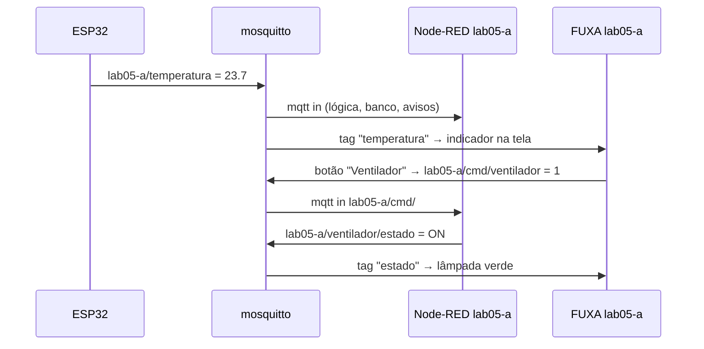

**3.1 Criar a conexão MQTT** (uma vez)

1. Abra o FUXA, clique no ícone de usuário (canto superior direito) e entre com o login do grupo.
2. Vá ao **Editor** e abra **Conexões** (_Connections_). Clique em **+**.
3. Preencha:

   | Campo    | Valor                   |
   | -------- | ----------------------- |
   | Nome     | `mqtt` (qualquer)       |
   | Tipo     | **MQTTclient**          |
   | Endereço | `mqtt://mosquitto:1883` |
   | Ativado  | ✅                      |

4. Salve. O ponto da conexão fica **verde** quando conecta.

**3.2 Criar as tags**

Abra a lista de tags da conexão e use **Browse/Navegar tópicos**: o FUXA mostra os tópicos que estão
chegando ao broker. Escolha os do seu grupo e marque:

- **Subscribe** para ler (ex.: `lab05-a/temperatura`). Se a mensagem for JSON
  (`{"t": 23.7, "u": 60}`), escolha o tipo **json** e indique o campo.
- **Publish** para comandar (ex.: `lab05-a/cmd/ventilador`).

**3.3 Montar a tela**

1. Em **Visualizações**, crie uma tela.
2. Arraste controles: **valor**, **gauge**, **gráfico**, **botão**, **interruptor**.
3. Nas propriedades de cada controle, escolha a **tag**. Num botão, use o evento de clique para
   **definir o valor** da tag de comando.
4. Clique em **Salvar Projeto** e abra `/fuxa/lab05-a/home` para ver a tela funcionando.

**3.4 O lado do Node-RED**

```text
[mqtt in  lab05-a/cmd/#] → [function: decide] → [mqtt out lab05-a/ventilador/estado]
```

```js
// function: liga/desliga conforme o comando vindo do FUXA
const ligado = String(msg.payload) === "1" || msg.payload === true;
msg.topic = "lab05-a/ventilador/estado";
msg.payload = ligado ? "ON" : "OFF";
return msg;
```

:::tip[Use sempre os tópicos do grupo]
Todas as tags do FUXA devem começar com `lab05-a/`. Assim, a tela funciona igual no laboratório e no
kit, e não interfere nos outros grupos.
:::

Se preferir HTTP em vez de MQTT, o FUXA tem o tipo de conexão **WebAPI**: aponte para um endpoint
do Node-RED do grupo, `http://lab05-a-nodered:1880/lab05-a/<endpoint>` (nó **http in**). Para levar a
tela para outro FUXA, use **Salvar Projeto Como...** (gera um `.json`) e **Abrir Projeto** no outro.

### 4. wastebin: colar e compartilhar código

Em **`/bin/`**, entre com o usuário e a senha do grupo, cole o trecho (código, log, fluxo exportado
do Node-RED), escolha a **validade** e clique para salvar. Copie o link e mande para quem precisa ver:
qualquer pessoa do lab abre o link com o login do próprio grupo.

Pela linha de comando (PowerShell ou Git Bash):

```bash
curl -u lab05-a:SENHA -H "Content-Type: application/json" -d '{"text":"print(42)"}' https://iot.adrianoruseler.com/bin/
```

:::warning[O wastebin é compartilhado]
Todo o laboratório pode abrir um link do wastebin. Não cole senhas nem dados pessoais.
:::

### 5. Avisos no celular (ntfy)

O **ntfy** manda **notificações push** para o celular do grupo. O Node-RED publica ("temperatura alta",
"porta aberta") e todos que assinaram o tópico do grupo recebem na hora, no laboratório ou em casa.

| Tópico                                                   | Quem usa                                              |
| -------------------------------------------------------- | ----------------------------------------------------- |
| `lab05-a`                                                | o seu grupo (lê e publica)                            |
| `lab05-a-…` (ex.: `lab05-a-alarme`, `lab05-a-relatorio`) | o seu grupo (crie quantos quiser, sempre com o hífen) |
| `lab05-avisos`                                           | avisos do professor para a turma (só leitura)         |

Outros grupos **não** leem nem publicam nos seus tópicos (e vice-versa).

#### 5.1 No celular

1. Instale o app **ntfy** (Play Store / F-Droid / App Store).
2. **Configurações → Usuários → +**: servidor `https://iot.adrianoruseler.com/ntfy`, usuário `lab05-a`
   e a senha do grupo.
3. **+ (assinar tópico)**: tópico `lab05-a`, marque _Usar outro servidor_ e informe o mesmo servidor.
   Repita para `lab05-avisos`.

No laboratório, `http://192.168.0.102/ntfy` também funciona. No iPhone, os avisos chegam quando o app
é aberto ou atualizado em segundo plano (no Android chegam na hora).

#### 5.2 No navegador

Abra **`/avisos/`** no portal e entre com o login do grupo: aparecem as mensagens das últimas 48 h, ao
vivo, e um formulário para publicar.

#### 5.3 No Node-RED

O Node-RED do grupo já tem as variáveis **`NTFY_URL`**, **`NTFY_TOPIC`** (= `lab05-a`) e
**`NTFY_TOKEN`**. Use um nó **function** seguido de um nó **http request** (método _- set by
msg.method -_, retorno _a parsed JSON object_):

```js
// function "avisar": msg.payload = texto; msg.topic = título
msg.url = env.get("NTFY_URL");
msg.method = "POST";
msg.headers = {
  Authorization: "Bearer " + env.get("NTFY_TOKEN"),
  "Content-Type": "application/json",
};
msg.payload = {
  topic: env.get("NTFY_TOPIC"), // ou env.get("NTFY_TOPIC") + "-alarme"
  title: msg.topic || "Aviso",
  message: String(msg.payload),
  priority: 4, // 1 (mínima) … 5 (urgente)
  tags: ["warning"], // vira emoji no celular
};
return msg;
```

Para não copiar à mão: baixe **`/avisos/exemplo-node-red.json`** e importe (_Menu → Import_). O
exemplo traz também o caminho **wastebin + ntfy** (próxima seção).

:::tip[Avise só o que importa]
Use prioridade 4–5 só para alarmes de verdade e um tópico separado (`lab05-a-debug`) para testes.
Um nó **rbe/filter** antes do aviso evita mandar a mesma mensagem a cada leitura do sensor.
:::

#### 5.4 Texto longo: wastebin + ntfy

Uma notificação aceita até 4 KB. Para logs, relatórios ou um fluxo inteiro, **guarde o texto no
wastebin e mande só o link no aviso**: no celular aparece o botão **"Abrir no wastebin"**.

- Na página `/avisos/`: marque _Texto longo: guardar no wastebin e mandar o link_.
- No Node-RED: o exemplo `exemplo-node-red.json` faz "colar no wastebin → avisar com link" usando
  `WASTEBIN_URL`, `WASTEBIN_AUTH` e `WASTEBIN_LINK`, já definidas no seu Node-RED.

### 6. MQTT

O broker MQTT do laboratório só é alcançável **na rede do laboratório** (em casa, use o do
[kit](#10-kit-do-grupo-no-seu-computador)).

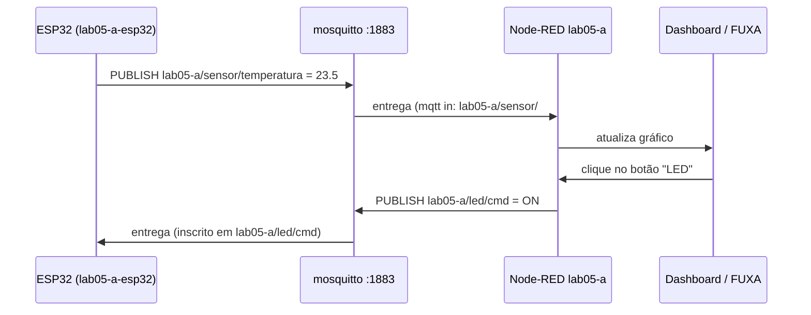

| Cliente                                     | Servidor (host)                  | Porta  |
| ------------------------------------------- | -------------------------------- | ------ |
| Node-RED e FUXA do grupo                    | `mosquitto`                      | `1883` |
| ESP32, celular, MQTTX, Python (rede do lab) | IP do servidor (`192.168.0.102`) | `1883` |

O broker não pede usuário nem senha. No Node-RED:

1. Arraste um nó **mqtt in** ou **mqtt out**.
2. Em _Server_, crie o broker com **Server** `mosquitto` e **Port** `1883`.
3. Em _Topic_, use o prefixo do grupo (ex.: `lab05-a/sensor/#`).
4. Clique em **Deploy**. O nó deve mostrar **connected**.

Mesmo editando o Node-RED **de casa** pelo endereço público, os nós MQTT continuam funcionando,
porque eles rodam no servidor do laboratório.

```cpp
const char* MQTT_HOST = "192.168.0.102";   // IP do servidor do laboratório (ou do seu PC, no kit)
const int   MQTT_PORT = 1883;

client.setServer(MQTT_HOST, MQTT_PORT);
client.connect("lab05-a-esp32");          // client id único por dispositivo
client.publish("lab05-a/sensor/temperatura", "23.5");
client.subscribe("lab05-a/led/cmd");
```

:::warning[Respeite os tópicos dos outros grupos]
O broker é compartilhado e não bloqueia tópicos. Publicar fora do seu prefixo atrapalha os outros
grupos e a avaliação.
:::

### 7. MQTT Explorer

Na rede do laboratório, abra o cartão **MQTT Explorer** (`http://192.168.0.102:3001/`). Ele já vem
conectado ao broker. Expanda `lab05-a` para ver as mensagens do grupo. Se pedir login, use as
credenciais **do MQTT Explorer** informadas pelo professor. Em casa, use o aplicativo MQTT Explorer
para Windows apontando para `localhost:1883` (kit).

### 8. Banco de dados SQLite

O nó **sqlite** está instalado. Grave o banco dentro da pasta de dados do Node-RED:

```text
Database: /data/meu_banco.db
```

### 9. Gitea: versionar o projeto

Seu grupo tem a organização privada **`lab05-grupo-a`** com o repositório **`nodered`**.

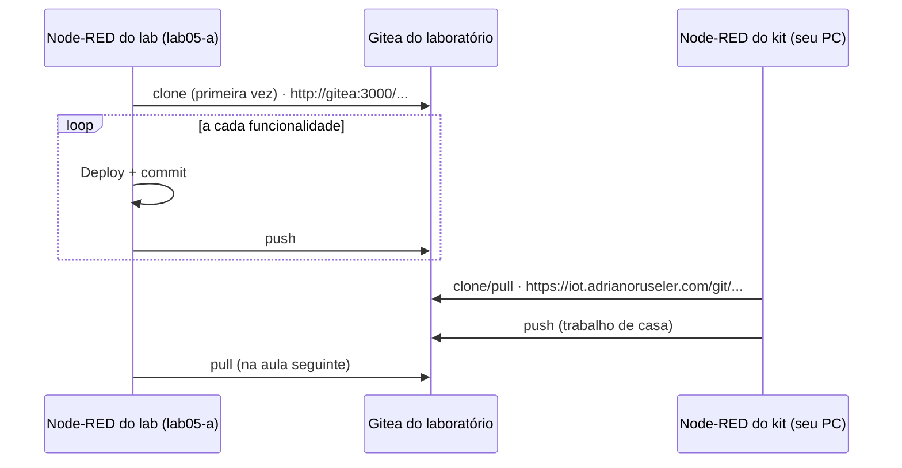

#### 9.1 Entrar no Gitea

Abra o cartão **Gitea** (`/git/`) e entre com o **mesmo usuário e senha** do grupo.

#### 9.2 Ligar o Node-RED ao repositório (Projects)

1. No primeiro acesso, o Node-RED abre o assistente de projetos. Informe nome e e-mail para os
   commits (ex.: `Grupo A`, `lab05-a@iot.lab`).
2. Escolha **Clone Repository**:

   | Campo          | No Node-RED do laboratório                    | No Node-RED do kit                                             |
   | -------------- | --------------------------------------------- | -------------------------------------------------------------- |
   | Repository URL | `http://gitea:3000/lab05-grupo-a/nodered.git` | `https://iot.adrianoruseler.com/git/lab05-grupo-a/nodered.git` |
   | Username       | `lab05-a`                                     | `lab05-a`                                                      |
   | Password       | senha do grupo                                | senha do grupo                                                 |

   No laboratório, use **`gitea:3000`**, o nome interno do Docker: o Node-RED roda dentro do
   servidor, e esse endereço funciona tanto no laboratório quanto de casa.

3. Defina uma **chave de criptografia das credenciais** e anote-a.
4. Se o Node-RED avisar que faltam arquivos do projeto (`package.json` ou o arquivo de fluxos),
   aceite criá-los.

No dia a dia, use a aba **Project history**:

- **commit**: em _Local changes_, marque os arquivos, clique em **commit** e escreva a mensagem;
- **push**: clique na seta ↑ para enviar ao Gitea; **pull**: seta ↓ para trazer o que foi feito no outro lugar.

:::tip[Commits pequenos e frequentes]
Faça um commit a cada funcionalidade que funcionar ("leitura do sensor ok",
"dashboard com gráfico"). O histórico ajuda o grupo a voltar atrás e mostra ao professor a
evolução do trabalho.
:::

#### 9.3 Clonar no seu PC (opcional)

Instale o Git for Windows (`winget install -e --id Git.Git`) e, no PowerShell:

<Tabs groupId="local">
<TabItem value="lab" label="No laboratório" default>

```powershell
git clone http://192.168.0.102/git/lab05-grupo-a/nodered.git
```

</TabItem>
<TabItem value="fora" label="De fora">

```powershell
git clone https://iot.adrianoruseler.com/git/lab05-grupo-a/nodered.git
```

</TabItem>
</Tabs>

O **Git Credential Manager** pede o usuário (`lab05-a`) e a senha do grupo. Em computador
compartilhado, remova a credencial ao final em **Painel de Controle → Gerenciador de Credenciais →
Credenciais do Windows**.

### 10. Kit do grupo no seu computador

O kit roda no **seu PC** o mesmo ambiente do grupo: Node-RED, FUXA, broker MQTT e ntfy,
com os **mesmos endereços e nomes** do laboratório. Serve para trabalhar em casa, sem depender do
servidor do lab, e para testar o ESP32 na sua rede.

**10.1 Instalar e subir**

1. Instale o **Docker Desktop** (com WSL 2) e abra-o:

   ```powershell
   wsl --install
   winget install -e --id Docker.DockerDesktop
   ```

2. Descompacte o `lab05-a.zip` numa pasta curta, sem espaços nem OneDrive (ex.: `C:\iot\lab05-a`).
3. No PowerShell, dentro dessa pasta:

   ```powershell
   cd C:\iot\lab05-a
   docker compose up -d --build
   ```

   A primeira vez demora alguns minutos. O arquivo **`LEIA-ME.md`** do kit tem o mesmo passo a passo.

**10.2 Endereços no kit**

| Serviço                          | Endereço                                |
| -------------------------------- | --------------------------------------- |
| Portal                           | `http://localhost/`                     |
| Node-RED                         | `http://localhost/lab05-a/`             |
| Dashboard                        | `http://localhost/lab05-a/dashboard`    |
| FUXA                             | `http://localhost/fuxa/lab05-a/`        |
| Avisos (ntfy)                    | `http://localhost/avisos/`              |
| App ntfy no celular (mesma rede) | servidor `http://IP-do-seu-PC/ntfy`     |
| MQTT (Node-RED/FUXA)             | `mosquitto:1883`                        |
| MQTT (ESP32 na sua rede)         | IP do seu PC (`ipconfig`), porta `1883` |

O login é o **mesmo do laboratório** (usuário `lab05-a` e a senha do grupo).

:::warning[Firewall do Windows]
Para o ESP32 alcançar o broker do seu PC, permita a porta 1883 quando o Windows perguntar (marque
**Redes privadas**) e deixe a sua rede de casa como **Privada**.
:::

**10.3 Levar o trabalho entre casa e laboratório**

| O quê                | Como                                                                                                                                              |
| -------------------- | ------------------------------------------------------------------------------------------------------------------------------------------------- |
| Fluxos do Node-RED   | **Projects** com o Gitea do laboratório ([seção 9.2](#92-ligar-o-node-red-ao-repositório-projects)): _push_ em casa, _pull_ no lab (e vice-versa) |
| Fluxos (alternativa) | Node-RED → menu → _Export_ → _Download_; no outro lado, _Import_                                                                                  |
| Telas do FUXA        | **Salvar Projeto Como...** (`.json`) e **Abrir Projeto** no outro FUXA                                                                            |

Como os nomes (`mosquitto`, `ntfy`), as variáveis (`NTFY_*`, `WASTEBIN_*`) e os tópicos são iguais,
nada precisa ser ajustado. No kit, o wastebin usado pelo Node-RED é o do laboratório (precisa de internet).

**10.4 Ponte MQTT com o laboratório (se o professor ativou)**

Quando o seu notebook com o kit está **na rede do laboratório**, o broker do kit troca as mensagens
`lab05-a/#` com o broker do laboratório: um ESP32 ligado ao seu notebook aparece no Node-RED e no FUXA
do grupo no servidor. Fora do laboratório, o kit funciona normalmente sem a ponte.

**10.5 Comandos úteis**

| Para                   | Comando                                  |
| ---------------------- | ---------------------------------------- |
| Ver o que está rodando | `docker compose ps`                      |
| Ver erros do Node-RED  | `docker compose logs -f lab05-a-nodered` |
| Parar (os dados ficam) | `docker compose down`                    |
| Subir de novo          | `docker compose up -d`                   |

Se a porta 80 do seu PC já estiver ocupada, troque `"80:80"` por `"8080:80"` no `docker-compose.yml`
e use `http://localhost:8080/`.

### 11. Boas práticas

- Dê **Deploy** com frequência e teste com nós **debug**.
- Faça commit e push no Gitea ao fim de cada aula (e de cada sessão em casa, no kit).
- Use sempre o prefixo do grupo nos tópicos MQTT, no Node-RED e nas tags do FUXA.
- Não guarde senhas reais em nós `function` ou `template`, nem no wastebin. Lembre que o dashboard e as
  telas do FUXA podem estar acessíveis pela internet.

### 12. Problemas comuns

| Sintoma                                    | Causa provável                             | O que fazer                                                                             |
| ------------------------------------------ | ------------------------------------------ | --------------------------------------------------------------------------------------- |
| "O laboratório está desligado no momento"  | servidor do lab desligado ou sem internet  | tente mais tarde; no lab, use o IP; em casa, use o kit                                  |
| O IP não abre, no laboratório              | rede diferente (ex.: Wi-Fi de visitantes)  | conecte-se à rede do laboratório                                                        |
| Login recusado                             | usuário ou senha errados                   | o usuário é `lab05-a` (sem `-view`); diferencia maiúsculas                              |
| Nó MQTT em _disconnected_                  | servidor errado no nó                      | use `mosquitto` e porta `1883`                                                          |
| FUXA: conexão MQTT vermelha                | endereço sem `mqtt://` ou com IP/localhost | use `mqtt://mosquitto:1883`                                                             |
| FUXA: não consigo editar                   | não entrou com o login                     | ícone de usuário → login do grupo                                                       |
| FUXA: tag sem valor                        | tópico diferente do publicado              | confira no MQTT Explorer o tópico exato (`lab05-a/...`)                                 |
| ESP32 não conecta                          | fora da rede do lab ou IP errado           | o broker do lab só existe na rede do laboratório; em casa, use o IP do seu PC com o kit |
| MQTT Explorer não abre de casa             | ele é só local                             | use-o no laboratório ou o app no seu PC                                                 |
| Clone no Node-RED falha                    | URL errada para o lugar                    | no lab: `http://gitea:3000/...`; no kit: `https://iot.adrianoruseler.com/git/...`       |
| "Repository not found"                     | organização de outro grupo                 | cada grupo só acessa a sua                                                              |
| wastebin pede senha de novo                | login errado                               | use o usuário e a senha de um grupo                                                     |
| ntfy: 403 ao publicar                      | tópico de outro grupo ou sem hífen         | use `lab05-a` ou `lab05-a-algo`                                                         |
| ntfy: app não recebe                       | servidor sem `/ntfy` ou sem login no app   | servidor `https://iot.adrianoruseler.com/ntfy` + usuário em _Configurações → Usuários_  |
| ntfy: "attachments not allowed" (HTTP 400) | mensagem com mais de 4 KB                  | mande o texto para o wastebin e o link no aviso                                         |
| Kit: "port is already allocated"           | porta 80 ou 1883 em uso no seu PC          | troque a porta no `docker-compose.yml` ou feche o outro programa                        |

---

## Referência rápida

<Tabs groupId="papel">
<TabItem value="prof" label="Professor" default>

```powershell
# no servidor do laboratório (uma vez)
py -m pip install bcrypt
cd C:\lab
py .\gen_iot_scada_ntfy_portal.py --lab lab05 --grupos 10 --ip 192.168.0.102
cd .\lab05
docker compose run --rm --no-deps --build tunel chave
ssh ubuntu@iot.adrianoruseler.com mkdir -p iot-lab
scp -r vps tunel\chave\id_ed25519.pub ubuntu@iot.adrianoruseler.com:iot-lab/
ssh -t ubuntu@iot.adrianoruseler.com sudo bash iot-lab/vps/setup-vps.sh iot-lab/id_ed25519.pub
docker compose up -d --build
docker compose logs -f tunel

# acessos nos READMEs dos grupos (Git Bash)
bash publicar-acessos-github.sh --dry-run
bash publicar-acessos-github.sh

# kits dos grupos (em C:\lab)
cd C:\lab
py .\gen_iot_scada_ntfy_portal.py --lab lab05 --grupos 10 --kit todos
```

</TabItem>
<TabItem value="aluno" label="Aluno">

| O quê                          | Onde                                                                                         |
| ------------------------------ | -------------------------------------------------------------------------------------------- |
| Usuário e senha                | README do repositório `lab05-grupo-<letra>` no GitHub                                        |
| Portal (no laboratório)        | `http://192.168.0.102/`                                                                      |
| Portal (de fora)               | `https://iot.adrianoruseler.com/`                                                            |
| Node-RED do grupo              | `/lab05-<letra>/`                                                                            |
| FUXA do grupo                  | `/fuxa/lab05-<letra>/` (editor: `.../editor`)                                                |
| Gitea                          | `/git/` (mesma senha)                                                                        |
| wastebin                       | `/bin/` (mesma senha)                                                                        |
| Avisos (ntfy) no navegador     | `/avisos/` (mesma senha)                                                                     |
| App ntfy (celular)             | servidor `https://iot.adrianoruseler.com/ntfy`, tópicos `lab05-<letra>`, `lab05-avisos`      |
| ntfy no Node-RED               | `env.get("NTFY_URL")`, `NTFY_TOPIC`, `NTFY_TOKEN` · exemplo: `/avisos/exemplo-node-red.json` |
| Broker no Node-RED             | `mosquitto:1883`                                                                             |
| Broker no FUXA                 | `mqtt://mosquitto:1883`                                                                      |
| Broker no ESP32 (só no lab)    | `192.168.0.102:1883`                                                                         |
| Tópicos                        | `lab05-<letra>/...`                                                                          |
| Repositório no Node-RED do lab | `http://gitea:3000/lab05-grupo-<letra>/nodered.git`                                          |
| Repositório no Node-RED do kit | `https://iot.adrianoruseler.com/git/lab05-grupo-<letra>/nodered.git`                         |
| Kit em casa                    | `docker compose up -d --build` → `http://localhost/`                                         |

</TabItem>
</Tabs>
