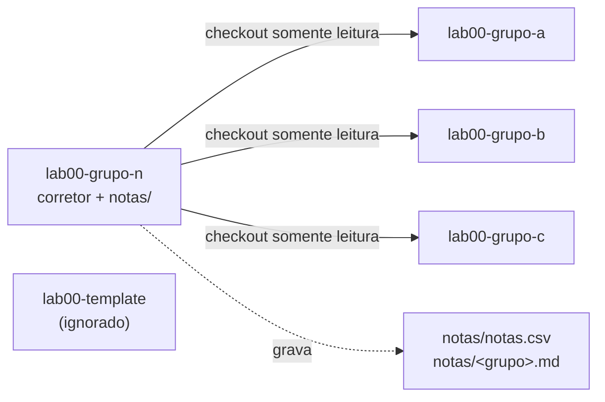

import Tabs from "@theme/Tabs";
import TabItem from "@theme/TabItem";

# Repositório de notas e correção automática

Cada aula tem um repositório de notas — **`<aula>-grupo-n`** (o "grupo N" de
**N**otas). Ele funciona como **corretor central daquela aula**: lê os
repositórios dos grupos (`<aula>-grupo-a`, `-grupo-b`, …), aplica a rubrica e
guarda os boletins em `notas/`.

Como a lógica de correção e o token de acesso ficam **dentro do `-grupo-n`** — ao
qual os grupos **não têm acesso** — não há nada que um grupo possa alterar no
próprio repositório para mudar a nota.

## Arquitetura



:::note[Diagrama Mermaid]
Para o diagrama acima renderizar, o site precisa do tema
`@docusaurus/theme-mermaid` habilitado (`markdown.mermaid: true` no
`docusaurus.config`). Sem ele, o bloco aparece como texto.
:::

Na organização `ELT85B-N21-2026-2`, o mesmo padrão se repete por aula:
`lab00-grupo-n` corrige `lab00-grupo-*`, `lab10-grupo-n` corrige `lab10-grupo-*`,
`projeto-grupo-n` corrige `projeto-grupo-*`, e assim por diante.

## Autoconfiguração

O grande truque: **os mesmos workflows servem para qualquer aula**. Nada de editar
caminhos ou listas — o despachante descobre tudo sozinho:

- A **aula** é deduzida do nome do próprio repositório. Em `grade-all.yml`:

  ```bash
  SELF='lab00-grupo-n'      # github.event.repository.name
  PREFIX="${SELF%-grupo-n}" # -> lab00
  ```

- Os **grupos** são listados pela convenção de nomes, excluindo o `-template`
  (que não casa com o filtro) e o próprio `-grupo-n`:

  ```bash
  gh repo list "$ORG" --limit 1000 --json name --jq '.[].name' \
    | grep -E "^${PREFIX}-grupo-" \
    | grep -vx "${PREFIX}-grupo-n"
  ```

Resultado: copiando o mesmo scaffold para cada `-grupo-n`, cada um passa a corrigir
automaticamente os grupos da sua aula.

## Os arquivos do scaffold

Um repositório de notas contém três arquivos essenciais:

```
.github/workflows/grade-one.yml    # reutilizável: corrige UM grupo
.github/workflows/grade-all.yml    # despachante: descobre, corrige todos e grava notas/
autograde/grade.py                 # a RUBRICA da aula (a única parte que muda por aula)
```

- **`grade-one.yml`** — workflow reutilizável (`workflow_call`). Recebe um `repo`
  de grupo, faz o checkout dele em modo leitura, roda o `grade.py` e publica o
  boletim (`GRADE.md` + `nota.csv`) como artefato.
- **`grade-all.yml`** — descobre os grupos, chama o `grade-one.yml` uma vez por
  grupo (em paralelo) e, no fim, consolida tudo em `notas/` e no resumo do run.
- **`grade.py`** — contém as tarefas, pontos e verificações. É a única peça que
  você adapta de uma aula para outra.

## Instalação

### Na organização (uma vez)

<Tabs>
<TabItem value="pat" label="Fine-grained PAT" default>

1. Crie um **fine-grained Personal Access Token** com acesso aos repositórios da
   organização e as permissões _Contents: Read-only_ e _Metadata: Read_.
2. Em **Org → Settings → Secrets and variables → Actions → New organization
   secret**, crie **`STUDENTS_TOKEN`** com esse token e libere-o para os
   repositórios `*-grupo-n`.

</TabItem>
<TabItem value="app" label="GitHub App (escala)">

Para muitas turmas, prefira um **GitHub App** instalado na organização com
_Contents: Read_ e _Metadata: Read_. Gere o token no workflow com
`actions/create-github-app-token` e use-o no lugar do `STUDENTS_TOKEN`. Vantagem:
privilégio mínimo e credenciais de curta duração.

</TabItem>
</Tabs>

:::tip[Configure o token só uma vez]
Como `STUDENTS_TOKEN` é um secret **de organização**, você não precisa cadastrá-lo
repositório por repositório — basta liberá-lo para os `*-grupo-n`.
:::

### Em cada aula

Copie os três arquivos do scaffold para cada repositório de notas (`lab00-grupo-n`,
`lab10-grupo-n`, `projeto-grupo-n`, …). Os dois YAML são **idênticos** em todas as
aulas; apenas o `autograde/grade.py` muda, refletindo a rubrica daquela aula.

## Como a correção casa commits com tarefas

A correção é baseada em commits. Cada tarefa é entregue por um commit cuja
**mensagem começa** com o código dela (`T1`, `T2`, …):

```bash
git add .
git commit -m "T1: implementa os cinco niveis de log"
git push
```

O corretor localiza o commit **mais recente** de cada código, volta o repositório
do grupo para **aquele estado** (via `git worktree`) e roda as verificações da
tarefa. Isso é essencial porque as tarefas costumam editar os **mesmos arquivos**
(ex.: mudar `CORE_DEBUG_LEVEL` de 5 para 2 e depois voltar para 5): olhando só o
estado final, seria impossível avaliar cada etapa — mas cada commit é um retrato
independente.

:::info[Regras da convenção]

- O código vai no **início** da mensagem: `T1: ...`, `T2: ...`.
- Pode **refazer** uma tarefa — vale o commit mais recente daquele código.
- `T1` **não** casa com `T10`: são tarefas diferentes.
- Tarefa sem commit correspondente vale **zero**.
  :::

## A rubrica (`grade.py`)

A rubrica é uma lista de tarefas. Cada tarefa tem `token`, `nome`, `pontos` e uma
lista de `checks`. A nota de cada tarefa é **proporcional** ao número de
verificações que passam.

```python title="autograde/grade.py (trecho)"
TAREFAS = [
  {"token": "T1", "nome": "Cinco niveis de log", "pontos": 15, "checks": [
      {"tipo": "contem", "arquivo": "src/main.cpp",   "padrao": r"\blog_e\s*\(", "desc": "usa log_e"},
      {"tipo": "contem", "arquivo": "platformio.ini", "padrao": r"CORE_DEBUG_LEVEL\s*=\s*5", "desc": "nivel 5"},
      {"tipo": "compila", "desc": "projeto compila"}]},
  # T2, T3, ... conforme a aula
]
```

### Tipos de verificação

<Tabs>
<TabItem value="contem" label="contem" default>

O arquivo indicado **deve casar** com o padrão (regex Python).

```python
{"tipo": "contem", "arquivo": "src/main.cpp", "padrao": r"\blog_i\s*\(", "desc": "usa log_i"}
```

</TabItem>
<TabItem value="nao_contem" label="nao_contem">

O arquivo **não deve** casar com o padrão. Útil para exigir que algo tenha sido
removido.

```python
{"tipo": "nao_contem", "arquivo": "src/main.cpp", "padrao": r"Serial\.print", "desc": "sem Serial.print"}
```

</TabItem>
<TabItem value="compila" label="compila">

O projeto **deve compilar** com `pio run`. É o portão mais forte: código quebrado
não pontua nesta verificação.

```python
{"tipo": "compila", "desc": "projeto compila"}
```

</TabItem>
</Tabs>

Para adaptar a rubrica a outra aula, edite apenas essa lista: troque os tokens, os
arquivos, os padrões e os pontos.

## Executando a correção

- **Todos os grupos:** aba **Actions → Grade all → Run workflow**, com o campo
  `only` vazio. Há também um agendamento diário (`schedule`) que pode rodar
  sozinho.
- **Um grupo só:** **Grade all → Run workflow** e informe o sufixo em `only`
  (ex.: `grupo-a`).

## Onde ficam as notas

Ao final, o job `report` grava **no próprio `-grupo-n`**:

- `notas/notas.csv` — planilha consolidada da turma (`grupo,nota,pontos,max`).
- `notas/<grupo>.md` — boletim detalhado de cada grupo, tarefa a tarefa.

Uma tabela-resumo também aparece no _summary_ do run em **Actions**. Como só o time
de notas acessa `*-grupo-n`, os boletins permanecem privados aos docentes.

## Verificação em execução com Wokwi (opcional)

Além das verificações estáticas e da compilação, é possível **simular** o firmware
no Wokwi dentro do CI para conferir a saída serial real (por exemplo, que todas as
macros de log aparecem). Isso requer um cenário de automação (`.test.yaml`) e o
secret `WOKWI_CLI_TOKEN`. Veja a página do laboratório correspondente para o
cenário e o job do Wokwi.

## Segurança — por que é à prova de adulteração

- A correção **executa apenas no `-grupo-n`**. Os grupos não veem o `grade.py`, os
  workflows, nem o `STUDENTS_TOKEN`. Alterar o próprio repositório não muda a
  correção nem a nota registrada.
- O checkout do grupo usa `persist-credentials: false`: o token de leitura **não
  fica gravado em disco** enquanto o código do grupo compila. Isso importa porque
  `pio run` pode executar código arbitrário definido pelo grupo (ex.:
  `extra_scripts` no `platformio.ini`). O token é somente-leitura e de escopo
  mínimo; os runners hospedados são efêmeros.
- O commit das notas usa `[skip ci]` e o `grade-all` **não** dispara em `push`,
  então não há laço de execução.

:::warning[Proteja o repositório de notas]
Ative proteção de branch no `-grupo-n` e fixe as _actions_ por SHA para impedir
mudanças não revisadas na lógica de correção. Se preferir não escrever no branch
principal, ajuste o passo _Commit do boletim_ para gravar num branch `notas`.
:::

## Solução de problemas

| Sintoma                                  | Causa provável                           | Solução                                                              |
| ---------------------------------------- | ---------------------------------------- | -------------------------------------------------------------------- |
| "Nenhum repositório de grupo encontrado" | Token sem acesso ou nomes fora do padrão | Confirme o `STUDENTS_TOKEN` e que os repos seguem `<aula>-grupo-<x>` |
| Todas as tarefas "sem commit"            | Convenção de mensagem não seguida        | As mensagens devem começar com `T1`, `T2`, …                         |
| `[ ] projeto compila` sempre falha       | Erro real de build no repo do grupo      | Abra o log do job `grade` para ver a saída do `pio run`              |
| Notas não são gravadas                   | Sem permissão de escrita                 | O `grade-all.yml` precisa de `permissions: contents: write`          |
| `gh: command not found`                  | Runner sem GitHub CLI                    | Use `ubuntu-latest` (o `gh` já vem instalado)                        |

## Referência rápida — rubrica do lab00

| Código | Tarefa                            | Pontos |
| ------ | --------------------------------- | ------ |
| `T1`   | Cinco níveis de log               | 15     |
| `T2`   | Filtragem por nível de compilação | 10     |
| `T3`   | Log com dados formatados          | 15     |
| `T4`   | Simulando um erro real            | 15     |

Total configurável em `autograde/grade.py`; a nota final é normalizada para 0–10.

## Componente `CommitPoint` (Docusaurus, TypeScript)

Insere no roteiro da aula um **ponto de commit** para o aluno, renderizado como um
**Admonition** do tema (`@theme/Admonition`, com o `type` que você escolher) e um
**CodeBlock** do tema (`@theme/CodeBlock`, que já traz destaque de sintaxe e botão
de copiar nativos). O comando segue a convenção que o autograder espera —
`T<n>: <tarefa>` — e o número **`<n>` é incrementado automaticamente** na ordem em
que os pontos aparecem na página.

### Instalação

Copie para o seu projeto Docusaurus (TypeScript):

```tsx
src/components/CommitPoint/index.tsx
src/theme/MDXComponents.tsx        # registra <CommitPoint/> globalmente
```

O `src/theme/MDXComponents.tsx` deixa o componente disponível em **qualquer**
`.mdx` sem `import`. Se você já tem um `MDXComponents`, apenas acrescente a linha do
`CommitPoint`.

### Uso no MDX

```md
<CommitPoint task="implementa os cinco niveis de log" pontos={15} />

<CommitPoint
  task="filtra logs com CORE_DEBUG_LEVEL=2"
  pontos={10}
  files="platformio.ini"
  type="info"
/>

<CommitPoint task="log com dados formatados" pontos={15} />
```

<CommitPoint task="implementa os cinco niveis de log" pontos={15} />

<CommitPoint
  task="filtra logs com CORE_DEBUG_LEVEL=2"
  pontos={10}
  files="platformio.ini"
  type="info"
/>

<CommitPoint task="log com dados formatados" pontos={15} />

Renderiza três admonitions numerados (`T1`, `T2`, `T3`), cada um com um bloco de
código copiável:

```bash
git add . && git commit -m "T1: implementa os cinco niveis de log" && git push
git add platformio.ini && git commit -m "T2: filtra logs com CORE_DEBUG_LEVEL=2" && git push
git add . && git commit -m "T3: log com dados formatados" && git push
```

Os tokens `T1`, `T2`, … coincidem com os `token` da rubrica em `autograde/grade.py`,
no repositório de notas. Um `CommitPoint` por tarefa, na ordem, e a numeração casa
com a correção.

### Props

| Prop     | Tipo                                                 | Padrão  | Descrição                                                       |
| -------- | ---------------------------------------------------- | ------- | --------------------------------------------------------------- |
| `task`   | `string`                                             | —       | Descrição da tarefa (obrigatória).                              |
| `type`   | `'note' \| 'tip' \| 'info' \| 'warning' \| 'danger'` | `'tip'` | Tipo do admonition.                                             |
| `pontos` | `number`                                             | —       | Pontos da tarefa; exibidos no título. (`points` também aceito.) |
| `files`  | `string`                                             | `'.'`   | Arquivos do `git add` (ex.: `"src/main.cpp"`).                  |
| `prefix` | `string`                                             | `'T'`   | Prefixo do token.                                               |
| `push`   | `boolean`                                            | `true`  | Inclui `&& git push` no comando.                                |
| `n`      | `number`                                             | auto    | Força o número, ignorando o incremento automático.              |
| `title`  | `ReactNode`                                          | auto    | Título; sobrescreve o padrão "Ponto de commit · `T<n>`".        |

### Numeração automática

Cada `CommitPoint` recebe um número sequencial na ordem do documento, por página. A
contagem é estável sob re-render e é **zerada ao sair da página**, então navegar e
voltar renumera corretamente. Para um commit intermediário que não é tarefa
avaliada, use `n` para fixar o número ou `prefix` para diferenciar.

### Observações

- Evite aspas duplas (`"`) dentro de `task`, pois o comando usa `-m "..."`.
- O botão de copiar e o destaque `bash` vêm do `@theme/CodeBlock`; nada de CSS
  próprio é necessário.
- O componente foi verificado com `tsc --strict` sob `@types/react` 18 e 19.

---

# Brief — Padrão de atividades de laboratório (ESP32 / PlatformIO / Wokwi)

Documento de referência para pedir uma **nova aula de laboratório** já no padrão do
curso. Cole este brief junto com o pedido e informe só o que muda (tema e tarefas).

## Contexto e stack

- **Plataforma:** ESP32 · **Ambiente:** PlatformIO (VS Code) · **Framework:** Arduino.
- **Simulador:** **Wokwi** (sem necessidade de placa física).
- **Documentação:** Docusaurus em **MDX**.
- **Entrega e correção:** Git + GitHub Actions, baseada em commits.
- **Organização:** `ELT85B-N21-2026-2`. Times `Grupo-A`, `Grupo-B`, … Repos por
  aula: `labNN-template`, `labNN-grupo-a/b/c…`, e `labNN-grupo-n` = **repositório de
  notas/correção** daquela aula (mesmo padrão para `projeto-*`).

## Formato do documento (MDX Docusaurus)

- Front matter completo (`id`, `title`, `sidebar_label`, `sidebar_position`, `slug`, `keywords`).
- Blocos de aviso como **admonitions** (`:::info`, `:::tip`, `:::warning`, `:::danger`, `:::note`).
- `import CommitPoint from '@site/src/components/CommitPoint';` no topo.
- Code blocks com `title="..."`; `<Tabs>`/`<TabItem>` quando útil; diagramas em
  bloco `mermaid` (requer `@docusaurus/theme-mermaid`).
- **Regra MDX:** manter todo código com `<`, `>`, `{`, `}`, `&` dentro de blocos/backticks
  e **evitar** esses caracteres nas strings `task="..."` dos CommitPoint.

## Wokwi como simulador

- No documento, incluir setup do Wokwi: extensão **Wokwi for VS Code**, `diagram.json`
  (circuito) e `wokwi.toml` apontando para o firmware compilado
  (`.pio/build/<env>/firmware.bin` e `.elf`). Fluxo: **Build** (PlatformIO) → **Wokwi: Start Simulator**.
- Sempre recompilar antes de simular (o Wokwi roda o binário já compilado).
- **Verificação em execução (opcional, CI):** cenário `test/*.test.yaml` com passos
  `wait-serial: "..."` para checar a saída serial; job com `wokwi/wokwi-ci-action@v1`
  e secret `WOKWI_CLI_TOKEN`.

## Pontos de commit (componente CommitPoint)

- Marcar cada tarefa avaliada com `<CommitPoint task="descrição" pontos={N} />`.
- Numeração **automática** em ordem do documento: `T1`, `T2`, … (props opcionais:
  `type`, `files`, `prefix`, `push`, `n`). Gera o comando
  `git add . && git commit -m "Tn: descrição" && git push`.
- Convenção de correção: **cada tarefa = um commit** cuja mensagem começa com `Tn:`.

## Correção automática

- **`grade.py`** (na `labNN-grupo-n`): lista `TAREFAS` com `token`, `nome`, `pontos` e
  `checks`. Tipos de check: `contem`, `nao_contem`, `compila` (roda `pio run`).
  Correção **por commit** (via `git worktree`); nota normalizada 0–10; gera
  `GRADE.md` + `nota.csv`.
- **Repo `labNN-grupo-n`** (autoconfigurável): deduz a aula pelo próprio nome,
  descobre os `labNN-grupo-*`, corrige em paralelo (`grade-one.yml` reutilizável +
  `grade-all.yml`), lê os repos dos grupos **somente leitura** (org secret
  `STUDENTS_TOKEN`, Contents: Read) e grava os boletins em `notas/`. À prova de
  adulteração (aluno não acessa o `-grupo-n`).
- **`gen_grade.py`**: gera o scaffold do `grade.py` a partir dos CommitPoint do MDX
  (`-o grade.py`) e tem modo **`--check`** que compara MDX × `grade.py` e aponta
  divergências (token faltando/sobrando, pontos, checks vazios) — para o CI.

## Fluxo ao criar uma nova aula

1. Escrever a aula em MDX com `CommitPoint` em cada tarefa.
2. `python gen_grade.py aula.mdx -o autograde/grade.py` → completar os `checks`.
3. Copiar o scaffold para `labNN-grupo-n` (workflows idênticos; só o `grade.py` muda).
4. (Opcional) Adicionar cenário Wokwi para checagem de saída serial no CI.

## Modelo de pedido (preencher ao solicitar)

- **Tema da aula / número (`labNN`):** …
- **Objetivos de aprendizagem:** …
- **Periféricos/circuito no Wokwi:** (LEDs, botões, sensores, I²C/SPI…) …
- **Tarefas avaliadas** (viram `CommitPoint` T1…Tn) e **pontos** de cada: …
- **Checagens desejadas por tarefa** (`contem`/`compila`/saída serial no Wokwi): …
- **Desafios/gabarito?** (sim/não)

---

# Componente `CommitPoint` (Docusaurus, TypeScript)

Insere no roteiro da aula um **ponto de commit** para o aluno, renderizado como um
**Admonition** do tema (`@theme/Admonition`, com o `type` que você escolher) e um
**CodeBlock** do tema (`@theme/CodeBlock`, que já traz destaque de sintaxe e botão
de copiar nativos). O comando segue a convenção que o autograder espera —
`T<n>: <tarefa>` — e o número **`<n>` é incrementado automaticamente** na ordem em
que os pontos aparecem na página.

## Instalação

Copie para o seu projeto Docusaurus (TypeScript):

```
src/components/CommitPoint/index.tsx
src/theme/MDXComponents.tsx        # registra <CommitPoint/> globalmente
```

Se você usava a versão anterior em JavaScript, **remova** os arquivos antigos para
não haver conflito de resolução do mesmo diretório:

```
src/components/CommitPoint/index.jsx         (apagar)
src/components/CommitPoint/styles.module.css (apagar — o estilo agora vem do tema)
src/theme/MDXComponents.js                   (apagar — substituido pelo .tsx)
```

O `src/theme/MDXComponents.tsx` deixa o componente disponível em **qualquer**
`.mdx` sem `import`. Se você já tem um `MDXComponents`, apenas acrescente a linha do
`CommitPoint`.

## Uso no MDX

```mdx
<CommitPoint task="implementa os cinco niveis de log" pontos={15} />

<CommitPoint
  task="filtra logs com CORE_DEBUG_LEVEL=2"
  pontos={10}
  files="platformio.ini"
  type="info"
/>

<CommitPoint task="log com dados formatados" pontos={15} />
```

Renderiza três admonitions numerados (`T1`, `T2`, `T3`), cada um com um bloco de
código copiável:

```bash
git add . && git commit -m "T1: implementa os cinco niveis de log" && git push
git add platformio.ini && git commit -m "T2: filtra logs com CORE_DEBUG_LEVEL=2" && git push
git add . && git commit -m "T3: log com dados formatados" && git push
```

Os tokens `T1`, `T2`, … coincidem com os `token` da rubrica em `autograde/grade.py`,
no repositório de notas. Um `CommitPoint` por tarefa, na ordem, e a numeração casa
com a correção.

## Props

| Prop     | Tipo                                                 | Padrão  | Descrição                                                              |
| -------- | ---------------------------------------------------- | ------- | ---------------------------------------------------------------------- |
| `task`   | `string`                                             | —       | Descrição da tarefa (obrigatória).                                     |
| `type`   | `'note' \| 'tip' \| 'info' \| 'warning' \| 'danger'` | `'tip'` | Tipo do admonition.                                                    |
| `pontos` | `number`                                             | —       | Pontos da tarefa; exibidos no título. (`points` também aceito.)        |
| `files`  | `string`                                             | `'.'`   | Arquivos do `git add` (ex.: `"src/main.cpp"`).                         |
| `prefix` | `string`                                             | `'T'`   | Prefixo do token.                                                      |
| `push`   | `boolean`                                            | `true`  | Inclui `&& git push` no comando.                                       |
| `n`      | `number`                                             | auto    | Força o número, ignorando o incremento automático.                     |
| `title`  | `ReactNode`                                          | auto    | Título; sobrescreve o padrão "Ponto de commit · `T<n>`".               |
| `id`     | `string`                                             | auto    | Id da âncora para deep-link; padrão = token em minúsculas (ex.: `t1`). |

## Âncoras (referência rápida)

Cada `CommitPoint` renderiza dentro de um elemento com `id` derivado do token em
minúsculas (`T1` → `t1`), permitindo deep-link direto ao ponto:

- Na mesma página: `[ir para T3](#t3)`
- De outra página: `/lab/estruturas-de-controle#t3`

O título exibe um `#` clicável (copia o link) e a rolagem já respeita a altura da
navbar via `scroll-margin-top`. Para um id personalizado:

```mdx
<CommitPoint task="entrega final do projeto" id="entrega-final" pontos={20} />
```

## Numeração automática

Cada `CommitPoint` recebe um número sequencial na ordem do documento, por página. A
contagem é estável sob re-render e é **zerada ao sair da página**, então navegar e
voltar renumera corretamente. Para um commit intermediário que não é tarefa
avaliada, use `n` para fixar o número ou `prefix` para diferenciar.

## Observações

- Evite aspas duplas (`"`) dentro de `task`, pois o comando usa `-m "..."`.
- O botão de copiar e o destaque `bash` vêm do `@theme/CodeBlock`; nada de CSS
  próprio é necessário.
- O componente foi verificado com `tsc --strict` sob `@types/react` 18 e 19.
