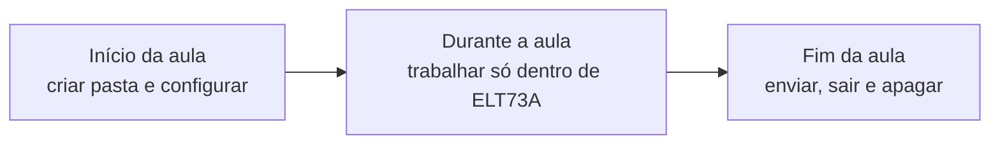

import {
  LabSetup,
  LabLogout,
} from "@site/src/components/shared/InstructionsSite";

# Máquina compartilhada do laboratório

Os computadores do laboratório são usados por várias turmas. Tudo o que você
configura (login no GitHub, nome e e-mail do Git, repositórios clonados) **fica
na máquina** depois que você sai, a menos que você apague.

Se isso não for feito, o próximo aluno pode:

- fazer `push` **com a sua conta** sem perceber;
- ver a janela **"Select an account"** com o seu usuário na lista;
- fazer commits com o **seu nome e e-mail**.

Este guia organiza a aula em três momentos, sempre a partir de uma única
**pasta-mãe** (`ELT73A`):



<LabSetup />

:::info[Use o Prompt de Comando (cmd)]
Todos os comandos deste guia são para o **Prompt de Comando** do Windows, não
para o PowerShell.

- Para abrir: `Win+R`, digite `cmd` e pressione Enter.
- No terminal do VS Code: na seta ao lado do `+`, escolha **Command Prompt**.

`%USERPROFILE%` é a sua pasta de usuário (por exemplo, `C:\Users\aluno`). O cmd
troca esse nome pelo caminho real automaticamente.
:::

:::note[Este guia não é avaliado]
Não há pontos de commit aqui. A **Parte 1** é feita no início de cada aula e a
**Parte 2**, obrigatoriamente, antes de sair do laboratório.
:::

## Objetivos

- Criar a pasta-mãe `ELT73A` e trabalhar somente dentro dela.
- Configurar nome, e-mail e conta do Git **apenas** para essa pasta.
- Entrar no GitHub pelo `gh` e abrir os repositórios no VS Code sem Modo Restrito.
- No fim da aula, remover **todas** as credenciais, configurações e arquivos.

## Parte 1 — Início da aula {/* #inicio */}

Abra um **Prompt de Comando** e mantenha a mesma janela aberta até o fim da
Parte 1: as variáveis do passo 1.2 valem só nela.

### 1.1 Criar a pasta-mãe {/* #criar */}

```bat title="cmd"
mkdir "%USERPROFILE%\ELT73A"
cd /d "%USERPROFILE%\ELT73A"
```

Se a pasta já existir (sobra de outra aula), o `mkdir` avisa que ela já existe.
Nesse caso, verifique se o conteúdo é seu antes de continuar. Se não for, ela
deveria ter sido apagada: siga a **Parte 2** para removê-la e recomece.

:::warning[Evite pastas sincronizadas]
Não crie a pasta-mãe no OneDrive nem em outra pasta sincronizada. A
sincronização trava arquivos dentro de `.git` e `.pio` e gera conflitos.
:::

### 1.2 Configurar o Git só para a pasta-mãe {/* #identidade */}

Em vez de gravar seu nome e e-mail na configuração **global** da máquina (que
vale para todos), eles vão para um arquivo separado, usado **somente** dentro
de `ELT73A`. Na limpeza, basta apagar esse arquivo.

Defina seus dados (troque pelos seus):

```bat title="cmd"
set "NOME=Nome Sobrenome"
set "EMAIL=seu.email@alunos.utfpr.edu.br"
set "GHUSER=sua-conta-github"
```

Crie o arquivo `.gitconfig-ELT73A` e ligue-o à pasta-mãe:

```bat title="cmd"
git config --file "%USERPROFILE%\.gitconfig-ELT73A" user.name "%NOME%"
git config --file "%USERPROFILE%\.gitconfig-ELT73A" user.email "%EMAIL%"
git config --file "%USERPROFILE%\.gitconfig-ELT73A" credential.https://github.com.username "%GHUSER%"
git config --global includeIf.gitdir/i:~/ELT73A/.path ~/.gitconfig-ELT73A
```

:::tip[Detalhes que fazem diferença]

- A **barra final** em `~/ELT73A/` é obrigatória: é ela que faz a regra valer
  para todas as subpastas.
- `gitdir/i` ignora maiúsculas e minúsculas no caminho, o que evita falhas por
  `C:` versus `c:` no Windows.
- A regra só vale **dentro de um repositório**. Na própria pasta-mãe (que não é
  um repositório), o Git não mostra esses valores, e isso é esperado.
- O `~` é interpretado pelo próprio Git como a sua pasta de usuário, por isso
  funciona também no cmd.
  :::

### 1.3 Entrar no GitHub {/* #login */}

```bat title="cmd"
gh auth login --hostname github.com --git-protocol https --web
```

1. Copie o código de uma vez exibido no terminal e pressione Enter.
2. No navegador, entre com a **sua** conta e cole o código.
3. Quando o `gh` perguntar se deve autenticar o Git com suas credenciais do
   GitHub, responda **Y**. Assim o Git usa o login do `gh` e a janela
   "Select an account" não aparece.

:::warning[Confira a conta no navegador]
Se o navegador já estiver logado no GitHub com a conta de outra pessoa, saia
dela antes de autorizar. Prefira uma **janela anônima/privada** para esse login.
:::

### 1.4 Clonar os repositórios dentro da pasta-mãe {/* #clonar */}

Na página de cada aula, o componente de clone indica o repositório do seu
grupo. Rode o comando **dentro** de `ELT73A`:

```bat title="cmd"
cd /d "%USERPROFILE%\ELT73A"
gh repo clone ELT73A-N21-2026-2/lab01-grupo-a
```

### 1.5 Abrir no VS Code e confiar na pasta-mãe {/* #confiar */}

```bat title="cmd"
code "%USERPROFILE%\ELT73A\lab01-grupo-a"
```

Na primeira vez, o VS Code pergunta se você confia nos autores dos arquivos.
Para que **todos** os repositórios da pasta-mãe abram sem Modo Restrito:

1. Marque **"Trust the authors of all files in the parent folder 'ELT73A'"**.
2. Clique em **"Yes, I trust the authors"**.

:::danger[Não desative o recurso]
Não use `"security.workspace.trust.enabled": false`. Em uma máquina
compartilhada, isso faz qualquer pasta (inclusive de outros usuários ou baixada
da internet) rodar tarefas e extensões sem aviso.
:::

### Verificação do início {/* #verificar */}

Entre no repositório clonado e rode os comandos abaixo. Preveja a saída antes
de executar.

```bat title="cmd"
cd /d "%USERPROFILE%\ELT73A\lab01-grupo-a"
git config --show-origin --get user.email
git config --show-origin --get credential.https://github.com.username
gh auth status
```

Saída esperada (resumida):

```text
file:C:/Users/aluno/.gitconfig-ELT73A	seu.email@alunos.utfpr.edu.br
file:C:/Users/aluno/.gitconfig-ELT73A	sua-conta-github
github.com
  ✓ Logged in to github.com account sua-conta-github (keyring)
  - Active account: true
  - Git operations protocol: https
  ...
```

O `--show-origin` mostra **de qual arquivo** veio cada valor. Se aparecer
`.gitconfig-ELT73A`, a regra por pasta está funcionando. Confira também se a
conta mostrada pelo `gh auth status` é a **sua**.

## Parte 2 — Fim da aula: limpeza obrigatória {/* #limpeza */}

:::danger[Faça antes de sair do laboratório]
Sem esta parte, a próxima pessoa que usar o computador terá acesso à sua conta
do GitHub e aos repositórios do seu grupo.
:::

Feche o VS Code antes de começar (ele trava arquivos da pasta) e abra um
**Prompt de Comando** novo.

### 2.1 Conferir se tudo foi enviado {/* #enviado */}

A pasta será apagada. O que não estiver no GitHub **será perdido**.

```bat title="cmd"
for /d %D in ("%USERPROFILE%\ELT73A\*") do @echo === %~nxD & git -C "%D" status -sb
```

Saída esperada para um repositório em dia:

```text
=== lab01-grupo-a
## main...origin/main
```

Se aparecer `[ahead 1]` (commits não enviados) ou nomes de arquivos abaixo da
linha `##` (alterações não commitadas), entre no repositório, faça o commit
e o `push`, e rode a verificação de novo.

:::note[Em arquivo .cmd]
O comando acima é para digitar no prompt. Dentro de um arquivo `.cmd`, troque
`%D` por `%%D` e `%~nxD` por `%%~nxD`.
:::

### 2.2 Sair do GitHub no `gh` e no Git {/* #sair-github */}

Remova o login do `gh`:

```bat title="cmd"
gh auth logout --hostname github.com --user sua-conta-github
```

Se em algum momento a janela "Select an account" apareceu, o Git também salvou
a conta no **Git Credential Manager**. Liste e remova:

```bat title="cmd"
git credential-manager github list
git credential-manager github logout sua-conta-github
```

Por fim, procure credenciais do GitHub que tenham sobrado no **Gerenciador de
Credenciais** do Windows:

```bat title="cmd"
cmdkey /list | findstr /i github
```

Para cada linha encontrada, copie o texto que vem depois de `target=` e apague:

```bat title="cmd"
cmdkey /delete:git:https://github.com
```

:::warning[Apague só o que é seu]
Se aparecerem credenciais de outras contas, elas são sobras de outros alunos.
Avise o professor em vez de apagar sem confirmar.
:::

### 2.3 Sair da conta no VS Code {/* #sair-vscode */}

Se você entrou no GitHub pelo VS Code (Copilot, extensão do GitHub ou Settings
Sync), saia também por lá:

1. Abra o VS Code.
2. Clique no ícone de **Accounts** (canto inferior esquerdo).
3. Na sua conta do GitHub, clique em **Sign Out**.
4. Feche o VS Code.

### 2.4 Remover a configuração do Git {/* #remover-config */}

```bat title="cmd"
git config --global --remove-section includeIf.gitdir/i:~/ELT73A/
del "%USERPROFILE%\.gitconfig-ELT73A"
```

Se você (ou o setup da máquina) gravou nome e e-mail na configuração global,
remova também:

```bat title="cmd"
git config --global --unset user.name
git config --global --unset user.email
```

Se o valor já não existir, esses comandos não mostram nada (código de saída 5).
Isso é normal.

### 2.5 Apagar a pasta-mãe {/* #apagar */}

Só faça isso depois de conferir o passo 2.1.

```bat title="cmd"
cd /d "%USERPROFILE%"
rmdir /s /q "%USERPROFILE%\ELT73A"
```

:::danger[Não há lixeira]
O `rmdir /s /q` apaga sem pedir confirmação e sem enviar para a Lixeira.
:::

### Verificação da limpeza {/* #verificar-limpeza */}

```bat title="cmd"
gh auth status
git credential-manager github list
cmdkey /list | findstr /i github
git config --global --list
dir "%USERPROFILE%\ELT73A"
```

Resultado esperado:

| Comando                              | O que deve aparecer                                      |
| ------------------------------------ | -------------------------------------------------------- |
| `gh auth status`                     | Mensagem dizendo que você não está logado em nenhum host |
| `git credential-manager github list` | Nada                                                     |
| `cmdkey /list` com `findstr`         | Nada                                                     |
| `git config --global --list`         | Nenhuma linha com `ELT73A`, seu nome ou seu e-mail       |
| `dir` da pasta-mãe                   | "O sistema não pode encontrar o arquivo especificado"    |

## Solução de problemas

<details>
  <summary>O VS Code continua abrindo em Modo Restrito</summary>

- Verifique se o repositório está **dentro** de `ELT73A` (e não em Downloads,
  por exemplo).
- Pela paleta de comandos (`Ctrl+Shift+P`), execute
  **Workspaces: Manage Workspace Trust** e confira se a pasta `ELT73A` aparece
  em `Trusted Folders & Workspaces`. Se não aparecer, use **Add Folder** e
  selecione a pasta-mãe (não o repositório).

</details>

<details>
  <summary>A janela "Select an account" continua aparecendo</summary>

- Confira se, no `gh auth login`, você respondeu **Y** para autenticar o Git.
  Se não, rode `gh auth setup-git`.
- Rode a verificação do início: `credential.https://github.com.username` deve
  vir do arquivo `.gitconfig-ELT73A`.
- Se a lista mostrar contas de outras pessoas, elas são sobras de outros
  alunos: avise o professor.

</details>

<details>
  <summary>O push foi feito com a conta de outra pessoa</summary>

Alguém não fez a limpeza antes de você. Rode `gh auth status` para ver a conta
ativa, faça o logout dela (Parte 2.2) e o login com a sua (Parte 1.3). Avise o
professor para que o colega seja orientado.

</details>

<details>
  <summary>O commit saiu com o nome ou e-mail errado</summary>

Corrija o `.gitconfig-ELT73A` (passo 1.2) e, se o commit **ainda não foi
enviado**, ajuste o autor:

```bat title="cmd"
git commit --amend --reset-author --no-edit
```

Não use `git push --force` no repositório do grupo. Se o commit já foi enviado,
faça um **novo commit**: o que vale é o commit `Tn:` mais recente.

</details>

<details>
  <summary>O rmdir diz que a pasta está em uso</summary>

Feche o VS Code e qualquer terminal que esteja **dentro** da pasta-mãe. No
prompt atual, rode `cd /d "%USERPROFILE%"` antes de tentar de novo.

</details>

## Checklist

**Início da aula**

- [ ] Pasta `ELT73A` criada em `%USERPROFILE%`.
- [ ] `.gitconfig-ELT73A` criado e ligado à pasta com `includeIf`.
- [ ] Login feito com a **minha** conta (`gh auth status`).
- [ ] Repositório clonado dentro de `ELT73A` e aberto sem Modo Restrito.

**Fim da aula**

- [ ] Todos os repositórios sem `ahead` e sem alterações pendentes.
- [ ] Logout no `gh`, no Git Credential Manager e no VS Code.
- [ ] Nenhuma credencial do GitHub no `cmdkey /list`.
- [ ] `includeIf`, `.gitconfig-ELT73A`, nome e e-mail globais removidos.
- [ ] Pasta `ELT73A` apagada e verificação da limpeza conferida.

<LabLogout />
