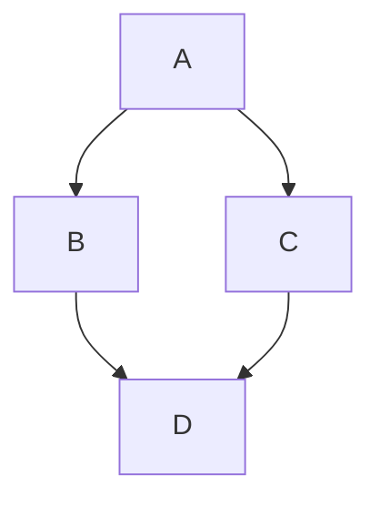

import Tabs from "@theme/Tabs";
import TabItem from "@theme/TabItem";
import { LABsApoio } from "@site/src/components/AvisosSite";
import LabFromTemplate from "@site/src/components/LabFromTemplate";
import {
  VerifyDev1,
  VerifyDev2,
  GitConfig,
  STM32Toolsv2,
  DevTools,
  GitLogOut,
  GitCommit,
} from "@site/src/components/InstructionsSite";
import LabTable from "@site/src/components/LabTable";
import LabTeamMembers from "@site/src/components/LabTeamMembers";

# Laboratório 01

{/* Info de que este conteúdo é de apoio! */}

<LABsApoio />

{/* Tabela com link para atividade, inicio, fim e descrição do LAB! */}

<div style={{ display: "flex", justifyContent: "center" }}>
  <LabTable index={1} internal={false} />
</div>

---

## Conteúdo

Git e GitHub; Ambiente de desenvolvimento;

- [ ] Uso do Git;
- [ ] Uso do GitHub;
- [ ] Crie uma organização no GitHub;
- [ ] Solicitar inclusão em um time;
- [ ] Ambiente de desenvolvimento;
- [ ] Comandos básicos, git e GitHub;

---

# Solicitar inclusão em um time

Esta página explica como pedir para ser adicionado(a) ao seu **grupo (time)** na
organização **`ELT73A-S22-2026-2`** do [GitHub](https://github.com/).

Toda solicitação é feita abrindo uma **issue** em um repositório dedicado, por meio
de um formulário. Depois de enviada, um administrador adiciona você ao time e fecha
a issue.

:::info[Pré-requisitos]

- Ter uma conta no [GitHub](https://github.com/).
- Saber o **slug do seu grupo** (de `grupo-a` até `grupo-j`).
- Conhecer o seu **username** do GitHub (o nome que aparece no seu perfil, sem o `@`).
  :::

## Passo a passo

### 1. Abra o formulário de solicitação

Acesse o repositório de solicitações e clique em [New issue](https://github.com/ELT73A-S22-2026-2/elt73a-central/issues/new/choose) (Nova issue), ou use
o [link direto](https://github.com/ELT73A-S22-2026-2/elt73a-central/issues/new?template=solicitar-time.yml):

### 2. Selecione o formulário

Na tela de escolha, selecione **"Solicitar inclusão em time"**.

### 3. Preencha os campos

| Campo                      | O que informar                                          |
| -------------------------- | ------------------------------------------------------- |
| **Grupo (slug do time)**   | Escolha o slug do seu grupo, de `grupo-a` a `grupo-p`.  |
| **Seu username do GitHub** | Seu nome de usuário, **sem o `@`**. Ex.: `octocat`.     |
| **Confirmação**            | Marque a caixa confirmando que o username está correto. |

:::caution[Confira o username]
Um username digitado errado impede a inclusão e atrasa o processo. Confirme no seu
perfil antes de enviar.
:::

- [ELT85B-N21-2026-2:LAB00](https://github.com/orgs/ELT85B-N21-2026-2/repositories?q=lab00)

```bash
Organization: ELT85B-N21-2026-2
│
├── Teams
│   ├── Grupo-A
│   ├── Grupo-B
│   ├── ...
│   └── Grupo-P (Professor)
│
└── Repositories
    ├── lab01-template
    ├── lab01-grupo-a
    ├── lab01-grupo-b
    ├── ...
    └── lab01-grupo-p (Professor)
```

## Verifique o seu ambiente de desenvolvimento

{/* List of Dev Tools */}

<DevTools />

---

{/* Configure o git */}

<GitConfig />

---

{/* Verifique o seu ambiente dev, git, gh e code */}

<VerifyDev1 />

---

## Clone o repositório inicial do LAB01

Escolha o seu grupo e entre com o comando abaixo para criar o repositório no GitHub:

<LabTeamMembers labName="lab01" />

{/* Git Commit */}

<GitCommit />

## Uso do git e GitHub

- [Melhores práticas do Git](/docs/git-best-practices).
- [Folha de Dicas de Git do GitHub](/docs/github-git-cheat-sheet).

import ConventionalCommitsTypes from "@site/src/components/ConventionalCommitsTypes";

## Conventional Commits em Projetos de Firmware e Sistemas Embarcados

Em projetos de firmware e sistemas embarcados (PlatformIO + VS Code + Wokwi para ESP32), a adoção da [Convenção Conventional Commits](https://www.conventionalcommits.org/) traz clareza, facilita a geração automática de changelogs e melhora a colaboração em atividades de laboratório.

Este documento apresenta a classificação dos tipos de commits e exemplos práticos orientados para o contexto de sala de aula.

### Estrutura Básica

```
<tipo>[escopo opcional]: <descrição curta>

[corpo opcional]

[rodapé(s) opcional(is)]
```

### Regras importantes

- A descrição deve ser escrita no **imperativo** e em minúsculas (exceto nomes próprios).
- Máximo recomendado de 72 caracteres na primeira linha.
- O escopo é opcional e geralmente indica o módulo ou componente afetado (`sensor`, `wifi`, `platformio`, `display`, etc.).
- Use o corpo para explicar o _porquê_ da mudança, não apenas o _o quê_.

### Classificação dos Tipos

| Tipo         | Quando usar                                                  | Exemplo de contexto em laboratório                    |
| ------------ | ------------------------------------------------------------ | ----------------------------------------------------- |
| **feat**     | Nova funcionalidade                                          | Implementar leitura de sensor DHT22                   |
| **fix**      | Correção de bug                                              | Corrigir overflow no buffer UART                      |
| **docs**     | Alterações apenas em documentação                            | Atualizar README com diagrama de conexão              |
| **style**    | Formatação, espaços, ponto e vírgula (sem mudança de lógica) | Ajustar indentação do código PlatformIO               |
| **refactor** | Mudança de código que não corrige bug nem adiciona feature   | Separar lógica de Wi-Fi em arquivo próprio            |
| **perf**     | Melhoria de performance                                      | Otimizar leitura ADC com media móvel                  |
| **test**     | Adição ou correção de testes                                 | Criar teste unitário para função de debounce          |
| **build**    | Mudanças no sistema de build ou dependências externas        | Atualizar versão da biblioteca FastLED                |
| **ci**       | Configuração de integração contínua                          | Adicionar workflow de build no GitHub Actions         |
| **chore**    | Tarefas de manutenção que não afetam o código-fonte          | Atualizar `.gitignore` ou limpar arquivos temporários |
| **revert**   | Reverter um commit anterior                                  | Desfazer commit que quebrou o simulador Wokwi         |

### Exemplos Práticos para Atividades de Laboratório

<ConventionalCommitsTypes />

O GitHub é uma plataforma de hospedagem de código-fonte e arquivos com controle de versão usando o Git.

- https://docs.github.com/pt/get-started/learning-about-github/github-glossary

### [Git](https://git-scm.com/)

| Git                                                                                                                                                                                                                                           | Git                                                                                                                                                                                                                      |
| --------------------------------------------------------------------------------------------------------------------------------------------------------------------------------------------------------------------------------------------- | ------------------------------------------------------------------------------------------------------------------------------------------------------------------------------------------------------------------------ |
| O Git é um programa de código aberto para acompanhamento de alterações em arquivos de texto. Ele foi escrito pelo autor do sistema operacional Linux e é a principal tecnologia na qual o GitHub, a interface social e do usuário, se baseia. | Git is an open source program for tracking changes in text files. It was written by the author of the Linux operating system, and is the core technology that GitHub, the social and user interface, is built on top of. |

### repository

| Repositório                                                                                                                                                                                                                                                                                                              | Repository                                                                                                                                                                                                                                                                                               |
| ------------------------------------------------------------------------------------------------------------------------------------------------------------------------------------------------------------------------------------------------------------------------------------------------------------------------ | -------------------------------------------------------------------------------------------------------------------------------------------------------------------------------------------------------------------------------------------------------------------------------------------------------- |
| Um repositório é o elemento mais básico do GitHub. É mais fácil imaginá-lo como uma pasta de projetos. Um repositório contém todos os arquivos de projeto (incluindo a documentação) e armazena o histórico de revisão de cada arquivo. Os repositórios podem ter vários colaboradores e podem ser públicos ou privados. | A repository is the most basic element of GitHub. They're easiest to imagine as a project's folder. A repository contains all of the project files (including documentation), and stores each file's revision history. Repositories can have multiple collaborators and can be either public or private. |

### commit

git-commit - Record changes to the repository

| confirmar                                                                                                                                                                                                                                                                                                                                                                                                                                       | commit                                                                                                                                                                                                                                                                                                                                                                            |
| ----------------------------------------------------------------------------------------------------------------------------------------------------------------------------------------------------------------------------------------------------------------------------------------------------------------------------------------------------------------------------------------------------------------------------------------------- | --------------------------------------------------------------------------------------------------------------------------------------------------------------------------------------------------------------------------------------------------------------------------------------------------------------------------------------------------------------------------------- |
| Commit, ou "revisão", é uma alteração individual em um arquivo (ou conjunto de arquivos). Quando você faz um commit para salvar seu trabalho, o Git cria uma ID exclusiva (também conhecida como o "SHA" ou "hash") que permite que você mantenha o registro das alterações específicas confirmadas com quem as fez e quando. Os commits normalmente contêm uma mensagem do commit, que é uma breve descrição de quais alterações foram feitas. | A commit, or "revision", is an individual change to a file (or set of files). When you make a commit to save your work, Git creates a unique ID (a.k.a. the "SHA" or "hash") that allows you to keep record of the specific changes committed along with who made them and when. Commits usually contain a commit message which is a brief description of what changes were made. |

```bash
git help commit
```

### pull

| pull                                                                                                                                                                                                                                                                 | pull                                                                                                                                                                                                                                                     |
| -------------------------------------------------------------------------------------------------------------------------------------------------------------------------------------------------------------------------------------------------------------------- | -------------------------------------------------------------------------------------------------------------------------------------------------------------------------------------------------------------------------------------------------------- |
| Pull refere-se a quando você busca alterações e as mescla. Por exemplo, se alguém editou o arquivo remoto no qual vocês dois estão trabalhando, o ideal é fazer pull dessas alterações na cópia local para que ele fique atualizado. Confira também [fetch](#fetch). | Pull refers to when you are fetching in changes and merging them. For instance, if someone has edited the remote file you're both working on, you'll want to pull in those changes to your local copy so that it's up to date. See also [fetch](#fetch). |

```bash
git help pull
```

### fetch

| fetch                                                                                                                                                                                                                                                  | fetch                                                                                                                                                                                                                                  |
| ------------------------------------------------------------------------------------------------------------------------------------------------------------------------------------------------------------------------------------------------------ | -------------------------------------------------------------------------------------------------------------------------------------------------------------------------------------------------------------------------------------- |
| Ao usar `git fetch`, você está adicionando alterações do repositório remoto ao branch de trabalho local sem fazer commit delas. Ao contrário de `git pull`, a busca permite que você revise as alterações antes de fazer commit delas no branch local. | When you use `git fetch`, you're adding changes from the remote repository to your local working branch without committing them. Unlike `git pull`, fetching allows you to review changes before committing them to your local branch. |

```bash
git help fetch
```

### clone

git-clone - Clone a repository into a new directory

| clone                                                                                                                                                                                                                                                                                                                                                                                                                                                                                                                            | clone                                                                                                                                                                                                                                                                                                                                                                                                                                                    |
| -------------------------------------------------------------------------------------------------------------------------------------------------------------------------------------------------------------------------------------------------------------------------------------------------------------------------------------------------------------------------------------------------------------------------------------------------------------------------------------------------------------------------------- | -------------------------------------------------------------------------------------------------------------------------------------------------------------------------------------------------------------------------------------------------------------------------------------------------------------------------------------------------------------------------------------------------------------------------------------------------------- |
| Um clone é uma cópia de um repositório que fica em seu computador em vez de ficar em algum outro lugar em um servidor de site. Clonar significa o ato de fazer essa cópia. Quando você faz um clone, é possível editar os arquivos no seu editor preferido e usar o Git para acompanhar as alterações sem precisar ficar online. O repositório clonado ainda está conectado à versão remota, ou seja, você poderá enviar as alterações locais por push ao repositório remoto para mantê-las sincronizadas quando estiver online. | A clone is a copy of a repository that lives on your computer instead of on a website's server somewhere, or the act of making that copy. When you make a clone, you can edit the files in your preferred editor and use Git to keep track of your changes without having to be online. The repository you cloned is still connected to the remote version so that you can push your local changes to the remote to keep them synced when you're online. |

```bash
git help clone
```

### push

git-push - Update remote refs along with associated objects

| efetuar push                                                                                                                                                                                                                          | push                                                                                                                                                                                         |
| ------------------------------------------------------------------------------------------------------------------------------------------------------------------------------------------------------------------------------------- | -------------------------------------------------------------------------------------------------------------------------------------------------------------------------------------------- |
| Enviar por push significa enviar as alterações confirmadas para um repositório remoto no GitHub.com. Por exemplo, se você alterar algo localmente, poderá enviar por push essas alterações para que outras pessoas possam acessá-las. | To push means to send your committed changes to a remote repository on GitHub.com. For instance, if you change something locally, you can push those changes so that others may access them. |

```bash
git help push
```

### branch

git-branch - List, create, or delete branches

| branch                                                                                                                                                                                                                                                                                                                                                   | branch                                                                                                                                                                                                                                                                                                                               |
| -------------------------------------------------------------------------------------------------------------------------------------------------------------------------------------------------------------------------------------------------------------------------------------------------------------------------------------------------------- | ------------------------------------------------------------------------------------------------------------------------------------------------------------------------------------------------------------------------------------------------------------------------------------------------------------------------------------ |
| Um branch é uma versão paralela de um repositório. Está no repositório, mas não afeta a ramificação principal ou primária e permite que você trabalhe à vontade, sem prejudicar a versão "online". Depois de fazer as alterações desejadas, você poderá fazer uma mesclagem do branch novamente com a ramificação principal para publicar as alterações. | A branch is a parallel version of a repository. It is contained within the repository, but does not affect the primary or main branch allowing you to work freely without disrupting the "live" version. When you've made the changes you want to make, you can merge your branch back into the main branch to publish your changes. |

```bash
git help branch
```

### checkout

git-checkout - Switch branches or restore working tree files

| fazer checkout                                                                                                                                                                                                                                                                                                                                                                                                                                                             | checkout                                                                                                                                                                                                                                                                                                                                                                                                                                                              |
| -------------------------------------------------------------------------------------------------------------------------------------------------------------------------------------------------------------------------------------------------------------------------------------------------------------------------------------------------------------------------------------------------------------------------------------------------------------------------- | --------------------------------------------------------------------------------------------------------------------------------------------------------------------------------------------------------------------------------------------------------------------------------------------------------------------------------------------------------------------------------------------------------------------------------------------------------------------- |
| Use `git checkout` na linha de comando para criar um branch, alterar o branch de trabalho atual para outro branch ou até alternar para uma versão diferente de um arquivo de outro branch com `git checkout [branchname] [path to file]`. A ação de "check-out" atualiza toda ou parte da árvore de trabalho com um objeto de árvore ou um blob do banco de dados de objetos e atualiza o índice e o HEAD se toda a árvore de trabalho está apontando para um novo branch. | You can use `git checkout` on the command line to create a new branch, change your current working branch to a different branch, or even to switch to a different version of a file from a different branch with `git checkout [branchname] [path to file]`. The "checkout" action updates all or part of the working tree with a tree object or blob from the object database, and updates the index and HEAD if the whole working tree is pointing to a new branch. |

```bash
git help checkout
```

### fork

| fork                                                                                                                                                                                                                                                                                                                                                                                  | fork                                                                                                                                                                                                                                                                                                                                                  |
| ------------------------------------------------------------------------------------------------------------------------------------------------------------------------------------------------------------------------------------------------------------------------------------------------------------------------------------------------------------------------------------- | ----------------------------------------------------------------------------------------------------------------------------------------------------------------------------------------------------------------------------------------------------------------------------------------------------------------------------------------------------- |
| Uma bifurcação é uma cópia do repositório de outro usuário que está em sua conta. Os forks permitem que você faça alterações livremente em um projeto sem afetar o repositório upstream original. Você também pode abrir uma solicitação pull no repositório upstream e manter o fork sincronizado com as alterações mais recentes, pois os dois repositórios ainda estão conectados. | A fork is a personal copy of another user's repository that lives on your account. Forks allow you to freely make changes to a project without affecting the original upstream repository. You can also open a pull request in the upstream repository and keep your fork synced with the latest changes since both repositories are still connected. |

### merge

git-merge - Join two or more development histories together

| mesclar                                                                                                                                                                                                                                                                                                                                                                                                                                                               | merge                                                                                                                                                                                                                                                                                                                                                                                           |
| --------------------------------------------------------------------------------------------------------------------------------------------------------------------------------------------------------------------------------------------------------------------------------------------------------------------------------------------------------------------------------------------------------------------------------------------------------------------- | ----------------------------------------------------------------------------------------------------------------------------------------------------------------------------------------------------------------------------------------------------------------------------------------------------------------------------------------------------------------------------------------------- |
| O merge pega as alterações de um branch (no mesmo repositório ou a partir de uma bifurcação) e as aplica em outro. Normalmente, isso ocorre por meio de uma "solicitação de pull" (que pode ser considerada uma solicitação de mesclagem) ou por meio da linha de comando. Uma mesclagem pode ser feita por meio de uma solicitação de pull pela interface da Web GitHub.com se não há alterações conflitantes ou sempre pode ser feita por meio da linha de comando. | Merging takes the changes from one branch (in the same repository or from a fork), and applies them into another. This often happens as a "pull request" (which can be thought of as a request to merge), or via the command line. A merge can be done through a pull request via the GitHub.com web interface if there are no conflicting changes, or can always be done via the command line. |

```bash
git help merge
```

## Cheatsheet — Team members working with lab repos

**Org:** `ELT73A-S22-2026-2`  
**Your team:** `Grupo-X` → slug `grupo-x`  
**Your lab repo:** `lab01-grupo-x` (example)

---

Open in VS Code:

```bash
code .
# or, if you use a profile:
code . --profile "ESP32IO"
```

---

## 2. Daily workflow

```bash
# Update from remote
git pull

# See status
git status

# Stage changes
git add .
# or specific files:
git add src/main.cpp

# Commit
git commit -m "Implement exercise 2"

# Push to GitHub
git push
```

If `git push` asks for a remote branch the first time:

```bash
git push -u origin main
```

---

## 3. Branch workflow (recommended)

```bash
# Create and switch to a branch
git checkout -b feature/ex2

# Work, commit, push
git add .
git commit -m "Exercise 2"
git push -u origin feature/ex2

# Open a PR into main
gh pr create --base main --title "Exercise 2" --body "Done"
```

After the PR is merged:

```bash
git checkout main
git pull
git branch -d feature/ex2
```

---

## 4. PlatformIO / embedded labs (if applicable)

```bash
# Build
pio run

# Upload to board
pio run -t upload

# Serial monitor
pio device monitor

# Run tests
pio test
```

---

## 5. What you **can** and **cannot** do

| Action                                        | Allowed?                 |
| --------------------------------------------- | ------------------------ |
| Clone / pull / push to **your** group repo    | Yes (if team has `push`) |
| Create branches / commits                     | Yes                      |
| Open issues / PRs in your repo                | Yes                      |
| Edit other groups’ repos (`lab00-grupo-b`, …) | No                       |
| Delete the repository                         | No (usually)             |
| Change team / org settings                    | No                       |
| Access `lab00-template` (if private)          | Only if granted          |

Your access comes from the **team** (`grupo-a`, etc.), not from being repo admin.

---

## 6. Quick reference by lab

| Lab     | Repository                          |
| ------- | ----------------------------------- |
| LAB00   | `ELT73A-S22-2026-2/lab00-grupo-a`   |
| LAB05   | `ELT73A-S22-2026-2/lab05-grupo-a`   |
| Projeto | `ELT73A-S22-2026-2/projeto-grupo-a` |

Replace `a` with your group letter (`b`, `c`, …).

Clone pattern:

```bash
gh repo clone ELT73A-S22-2026-2/lab05-grupo-a
```

---

## 7. Common problems

**Permission denied on push**

- Confirm you are logged in: `gh auth status`
- Confirm you are in the right team/repo
- Ask the instructor to check team access (`push` on the repo)

**Repo not found**

```bash
gh repo view ELT73A-S22-2026-2/lab00-grupo-a
```

If 404: wrong name, or you are not a member of the org/team yet.

**Merge conflicts**

```bash
git pull
# fix conflicted files
git add .
git commit -m "Resolve merge conflicts"
git push
```

**Undo local changes (destructive)**

```bash
git checkout -- .
git clean -fd
```

---

## 8. Minimal “start of lab” checklist

1. `gh auth status` (logged in)
2. `gh repo clone ELT73A-S22-2026-2/labXX-grupo-y`
3. `cd labXX-grupo-y`
4. `code .`
5. Work → `git add` → `git commit` → `git push`
6. Check CI: `gh run list`

---

## 9. One-liner cheat card

```text
clone   →  gh repo clone ORG/lab00-grupo-a
update  →  git pull
save    →  git add . && git commit -m "msg" && git push
web     →  gh repo view --web
ci      →  gh run list
```

## Criando diagramas

- https://docs.github.com/pt/get-started/writing-on-github/working-with-advanced-formatting/creating-diagrams

Here is a simple flow chart:

````md

````

---


---

## Como escrever expressões matemáticas

- https://docs.github.com/pt/get-started/writing-on-github/working-with-advanced-formatting/writing-mathematical-expressions

```bash
**The Cauchy-Schwarz Inequality**\
$$\left( \sum_{k=1}^n a_k b_k \right)^2 \leq \left( \sum_{k=1}^n a_k^2 \right) \left( \sum_{k=1}^n b_k^2 \right)$$
```

**The Cauchy-Schwarz Inequality**\
$$\left( \sum_{k=1}^n a_k b_k \right)^2 \leq \left( \sum_{k=1}^n a_k^2 \right) \left( \sum_{k=1}^n b_k^2 \right)$$

---

## Static Badge

- https://shields.io/badges


## Como formatar o seu código em C no VScode

Como formatar o seu código em C no VScode

<iframe
  width="560"
  height="315"
  src="https://www.youtube.com/embed/GsGjdF7TkoM?si=CTQkIU3wxt4tFkck"
  title="YouTube video player"
  frameborder="0"
  allow="accelerometer; autoplay; clipboard-write; encrypted-media; gyroscope; picture-in-picture; web-share"
  referrerpolicy="strict-origin-when-cross-origin"
  allowfullscreen
></iframe>

## Escolha e configuração de temas no VScode

Escolha e configuração de temas no VScode

<iframe
  width="560"
  height="315"
  src="https://www.youtube.com/embed/p1kprMBB9fQ?si=iPNpFzCl0s-8u58V"
  title="YouTube video player"
  frameborder="0"
  allow="accelerometer; autoplay; clipboard-write; encrypted-media; gyroscope; picture-in-picture; web-share"
  referrerpolicy="strict-origin-when-cross-origin"
  allowfullscreen
></iframe>

---

{/* Logout do seu ambiente dev, git e gh */}

<GitLogOut />
